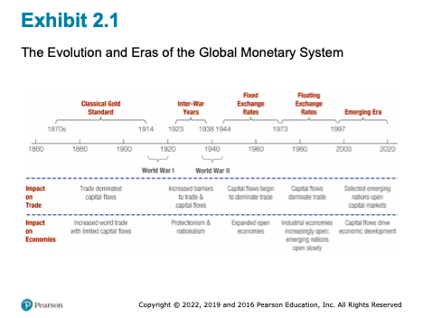
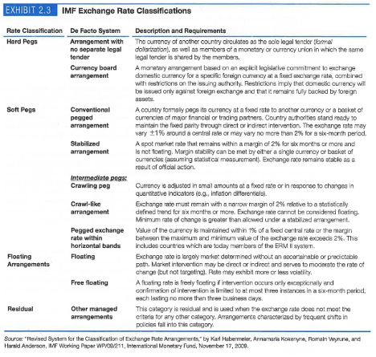
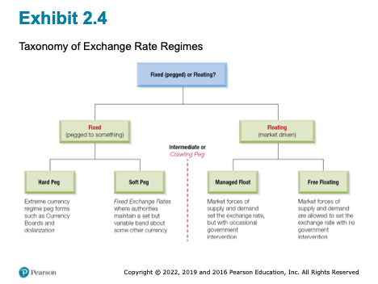
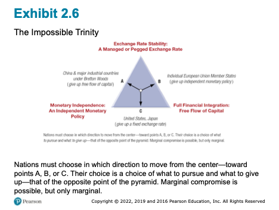

# Introduction

Random Quote: **Every sheep lives in fear of the wolf, only to be eaten by the shepherd. Choose your shepherd wisely.**

"The price of every thing rises and falls from time to time and place to place; and with every such change the purchasing power of money changes so far as that thing goes."\
— Alfred Marshall

## Chapter Roadmap {.unnumbered}

Major section:

1.  **The History of the International Monetary System** - How did we get here?
2.  **Fixed versus Flexible Exchange Rates** - What are they and how do we choose?
3.  **The Impossible Trinity** - The trilemma of international finance.
4.  **A Single Currency for Europe: The Euro** - Can countries work together as one economy?
5.  **Internationalization of the Chinese RMB** - The Chinese approach
6.  **Emerging Markets and Regime Choices** - The Final Frontier?

------------------------------------------------------------------------

## History of the International Monetary System

"No world central bank issues a separate currency for commerce across national boundaries. Instead, a "system" of national monies works more or less well in providing a medium of exchange and unit of account for current international transactions, as well as a store of value and standard of deferred payment for long-term borrowing and lending."

-   Ronald I. McKinnon, Rules of the Game: International Money in Historical Perspective, Journal of Economic Literature, Vol. 31, No. 1, March 1993, pp.1-44

{width="85%"}

### The Classical Gold Standard (1879-1913)

**How It Worked:** - Each currency pegged to fixed amount of gold - Example: \$20.67 = 1 oz gold (US), £4.2474 = 1 oz gold (UK) - Therefore: \$20.67/£4.2474 = \$4.87/£1 - Exchange rates FIXED through gold link. The rate was generally determined by how much gold each country held.

**Czar Nicholas II's 1894 Bond Example:** - 100-year Russian bearer bond - Payable in SIX currencies: roubles, francs, marks, pounds, florins, dollars - Possible because fixed exchange rates made all currencies predictable - Investors received interest in currency of choice

**"Rules of the Game":**

1.  Governments buy/sell gold on demand at fixed parity
2.  Requires maintaining gold reserves
3.  Money supply limited to rate of gold acquisition
4.  Inherently anti-inflationary

**Why It Failed:** - WWI disrupted trade and gold flows - Countries suspended convertibility to finance war - System couldn't handle modern economic pressures

### The Interwar Years and World War II (1914-1944)

**The Chaos:** - Post-WWI: Floating rates led to speculation - Weak currencies sold short, driving them lower - Britain left gold standard 1931 (couldn't maintain reserves) - US modified system 1934 (\$35/oz, central banks only) - Great Depression: Trade collapsed, protectionism (tariffs) rose

**Example:** During the Spanish Civil War (1936-1939), the Soviet Union stole millions of dollars worth of gold from Spain. They claimed they placing it into "safekeeping" so the Germans would not capture it. Spain never saw their gold again.

**Lesson:** Flexible rates without institutions = instability and reduced trade

### Bretton Woods and the International Monetary Fund (1944)

**The Debate:** - John Maynard Keynes (UK): Wanted flexibility - Harry Dexter White (US): Wanted stability - Compromise: Fixed but adjustable rates

The Bretton Woods Agreement represented a pragmatic compromise between the rigidity of the gold standard and the chaos of the interwar period. It established a dollar-centered system of fixed but adjustable exchange rates, supported by the creation of the International Monetary Fund (IMF) and the World Bank.

Under Bretton Woods, currencies were pegged to the U.S. dollar, and the dollar alone was convertible into gold at \$35 per ounce. The IMF was designed to provide temporary financing to countries facing balance-of-payments difficulties, thereby reducing the need for abrupt devaluations. (Balance of Payments will be Chapter 3)

**Three Pillars:**

1.  **Fixed Exchange Rates**
    -   All currencies pegged to USD
    -   USD pegged to gold at \$35/oz
    -   ±1% bands (later ±2.25%)
    -   Devaluations \<10% without IMF approval
2.  **International Monetary Fund**
    -   Temporary assistance for currency defense
    -   Pool of currencies/gold to lend
    -   Monitor balance of payments
3.  **World Bank**
    -   Postwar reconstruction
    -   Economic development

**Special Drawing Rights (1969):** Current basket (2016): - US dollar: 41.73% - Euro: 30.93% - Chinese yuan: 10.92% (added 2016!) - Japanese yen: 8.33% - British pound: 8.09%

#### Special Drawing Right (SDR)

An innovation of Bretton Woods was the creation of the Special Drawing Right. It is an international reserve asset created by the Internation Monetary Fund to supplement existing foreign exchange reserves. It is a mixture of several major currencies and provides an additional option for a currency to be pegged against. So instead of having a fixed exchange rate with the U.S. dollar, a country could peg its currency again the SDR.

### Fixed Exchange Rates (1945–1973)

During the postwar period, the Bretton Woods system supported rapid growth in world trade and investment. However, it relied heavily on U.S. monetary discipline. As global demand for dollars expanded, the United States ran persistent balance-of-payments deficits, creating an overhang of dollars (note) relative to U.S. gold reserves.

This structural tension undermined confidence in dollar convertibility and culminated in the suspension of gold convertibility in 1971. By 1973, fixed exchange rates among major currencies had collapsed.

**Why It Failed:** 1. US dollar overhang (persistent deficits) 2. 1971: Lost 1/3 of gold reserves in 7 months 3. August 15, 1971: Nixon closes gold window 4. March 1973: Currencies float

### Floating Exchange Rates (1973–1997)

Since 1973, most major currencies have floated against one another. Floating exchange rates allow for continuous adjustment to economic fundamentals and preserve monetary policy autonomy. However, they have also been associated with increased volatility and uncertainty.

The post-1973 era revealed that while floating rates reduce the likelihood of reserve crises, they do not eliminate exchange rate misalignment or financial instability.

### The Emerging Era (1997–Present)

Following the Asian Financial Crisis of 1997, global capital mobility increased dramatically. Capital flows began to dominate trade flows, particularly for emerging market economies. This shift placed new pressures on exchange rate regimes and exposed the fragility of intermediate arrangements.

------------------------------------------------------------------------

### IMF Classification of Currency Regimes

The IMF classifies exchange rate regimes based on observed behavior rather than official declarations. This shift from de jure to de facto classification reflects the recognition that governments often behave differently from their stated policies.

### The IMF’s De Facto System

**Four Categories:**

{width="85%"}
#### Summary around the world today

1.  **Hard Pegs (13%)**
    -   Dollarization: Ecuador, Panama, Zimbabwe
    -   Currency boards: Hong Kong, Bulgaria
    -   Given up monetary sovereignty
2.  **Soft Pegs (46%)**
    -   Conventional pegged
    -   Stabilized arrangements
    -   Crawling pegs
    -   Pegged within bands
3.  **Floating (34%)**
    -   With intervention
    -   Free floating
4.  **Residual (7%)**
    -   Frequent policy shifts

{width="85%"}

### A Global Eclectic

The contemporary international monetary system is best described as a global eclectic: a coexistence of diverse regimes with no single anchor or governing authority.

**Key Insight:** Distribution stable over past decade - no "best" system emerged

------------------------------------------------------------------------

## Fixed vs. Flexible Exchange Rates

The choice between fixed and flexible exchange rates reflects national priorities regarding inflation, growth, and policy sovereignty. Fixed rates provide stability and credibility but require monetary discipline and large reserve holdings. Flexible rates allow monetary autonomy and shock absorption but expose economies to volatility.

**Terminology matters:** official changes under fixed regimes are devaluations or revaluations, while market-driven changes under floating regimes are depreciations or appreciations.

---------------------------------------------------------------

## The Impossible Trinity

The Impossible Trinity, or trilemma, states that a country cannot simultaneously achieve exchange rate stability, full capital mobility, and independent monetary policy. Only two of the three are feasible at any given time.

This framework explains historical system breakdowns and contemporary regime choices. It clarifies why the United States floats, Europe adopted a single currency, and China maintains capital controls.

### The Core Framework

**Cannot simultaneously have:** 
1. Fixed exchange rate 
2. Free capital flows 
3. Independent monetary policy

{width="85%"}

**Why Impossible?** 
- Lower rates to stimulate (independent policy) 
- Capital flows out to higher rates (free capital) 
- Currency depreciates 
- Must raise rates to defend peg (lose independence) 
**Creates contradictions.**

**Three Choices:**

**Point A - China (traditional):** - Want: Monetary independence + Fixed rate - Give up: Free capital flows - Result: Capital controls

**Point B - EU Members:** - Want: Free capital flows + Fixed rates (euro) - Give up: Independent monetary policy\
- Result: ECB controls all policy

**Point C - US, Japan:** - Want: Monetary independence + Free capital - Give up: Fixed exchange rate - Result: Floating currency

**1997-98 Asian Crisis:** - Countries tried to have all three - When confidence collapsed: massive capital outflows - Couldn't defend fixed rates - Forced to float

**Key Point:** This isn't a suggestion - it's mathematical impossibility. There is no cheat code or workarounds.

------------------------------------------------------------------------

## A Single Currency for Europe: The Euro

### Creation Timeline

-   1979: EMS (fixed rate bands)
-   1991: Maastricht Treaty
-   1999: Euro launched (11 countries, electronic)
-   2002: Physical currency
-   Today: 19 of 28 EU countries

### The Maastricht Treaty and Monetary Union

The Maastricht Treaty committed European Union members to monetary union, replacing national currencies with the euro. Convergence criteria were designed to align macroeconomic conditions prior to entry.

Before joining: 1. Inflation ≤ 1.5% above 3 lowest members 2. Interest rates ≤ 2% above 3 lowest 3. Budget deficit ≤ 3% GDP 4. Debt ≤ 60% GDP 5. Two years exchange rate stability

### European Central Bank (ECB)

The ECB was established as an independent central bank with a primary mandate of price stability. National central banks ceded control over monetary policy while retaining supervisory roles.

-   Frankfurt-based
-   Independent
-   Primary mandate: Price stability
-   Modeled on German Bundesbank

### The Launch of the Euro

The euro was introduced in 1999 as a unit of account and in 2002 as physical currency. The transition was smooth due to decades of prior exchange rate coordination.

The euro represents a permanent resolution of the Impossible Trinity within Europe: exchange rate stability and capital mobility were preserved at the cost of national monetary sovereignty.

### Benefits

1.  Eliminated transaction costs
2.  Reduced currency risk
3.  Price transparency
4.  Increased trade (5-15% boost)
5.  International presence

### Challenges

1.  **Loss of Monetary Independence** (THE key sacrifice)
    -   Can't use rates/money supply for local problems
    -   Spain boom + Germany recession = one ECB rate for both
2.  **Asymmetric Shocks**
    -   Different countries, different problems
    -   One policy doesn't fit all
3.  **No Fiscal Union**
    -   Can't print money for debts
    -   Each country responsible for own debt
    -   No central budget for transfers
4.  **Labor Immobility**
    -   Language/cultural barriers
    -   Can't adjust like US labor market
5.  **No Initial Lender of Last Resort**

### Greek Crisis Case Study

**What Happened:** - Joined 2001 - Hid true deficits (12.7% vs 3% limit) - Debt \>120% (vs 60% limit) - 2009: Truth revealed - Interest rates skyrocketed - Couldn't borrow

**The Trap:** - Normally could: devalue currency, print money - With euro: COULDN'T do either - ECB controls currency

**"Solution":** - €300+ billion in bailouts - Harsh austerity: - Cut spending - Raise taxes - Reduce pensions - Fire workers

**Results:** - 25% unemployment (50% youth) - GDP fell 25% - Social unrest - But stayed in eurozone

**Lesson:** Impossible trinity perfectly illustrated - gave up monetary independence, had no tools when crisis hit.

## Internationalization of the Chinese RMB

### Renminbi Valuation

China operates a managed float in which the central bank sets a daily parity rate and allows limited market movement. Exchange rate stability remains a policy priority.

### Two-Market Currency Development

The RMB operates in a segmented onshore (CNY) and offshore (CNH) structure. This allows China to experiment with international use while maintaining domestic control.

**Onshore (CNY):** - Heavily regulated - Capital controls - People's Bank of China (PBC) sets daily parity - Trading within ±1-2%

**Offshore (CNH - Hong Kong):** - More flexible - Less regulated - Panda Bonds(note) issued here - Expanding to Singapore, London

### Internationalization: Theoretical Principles and Practical Concerns

Internationalization occurs in stages: trade use, investment use, and reserve currency status. China has advanced unevenly across these dimensions, constrained primarily by capital controls.

**Level 1: Trade Currency** - Despite being largest trader: - 93% imports in USD - 95% exports in USD - RMB use growing but LOW

**Level 2: Investment Currency** - Gradual opening via: - RQFII (Renminbi Qualified Foreign Institutional Investor) program - Bond Connect - Stock Connect - Fear of capital flight

**Level 3: Reserve Currency** - Added to SDR 2016 at 10.92% - 2-3% of global reserves - Forecasts: 15-50% by 2024 (huge range = uncertainty)

### Triffin Dilemma

As with earlier reserve currencies, widespread international use of the RMB would require China to supply liquidity to the world, potentially conflicting with domestic policy objectives.

**The Paradox:** 1. World needs your currency → run deficits to supply it 2. But persistent deficits → growing debt → undermines confidence

**China's Problem:** - To be reserve currency needs: - Current account deficits - Free capital outflows - Policy independence loss - But China has: - Current account surpluses - Tight capital controls - Values independence

### Currency Trading Hubs

**Strategy:** - Clearing centers in: Hong Kong, London, Singapore, Frankfurt, NYC, Sydney - Make RMB accessible globally - But maintain control through approved institutions

## Emerging Markets and Regime Choices

### Currency Boards

#### Argentina

Argentina’s currency board initially stabilized inflation but ultimately collapsed due to overvaluation, recession, and loss of confidence.

**Structure:** - Every peso backed 100% by US dollars - Government can't print money without reserves - Peso pegged 1:1 to dollar

**Success:** - Inflation: 3,000% → single digits - Economy grew - Confidence restored

**Failure:** - Lost flexibility - Brazil devalued 1999 → Argentine exports uncompetitive - Couldn't devalue - 3-year recession - No lender of last resort - Political pressure

**Collapse (2001-2002):** - Bank deposits frozen - Riots - President resigned - Peso: 1:1 → 4:1

### Dollarization

Dollarization involves adopting a foreign currency outright, eliminating exchange rate risk but also monetary sovereignty.

#### Ecuador

Ecuador adopted the U.S. dollar following severe inflation and banking crises, gaining stability at the cost of policy flexibility.

- 1999 crisis: Sucre 25,000 per dollar - Adopted dollar January 2000 - Stability achieved but limited shock response

#### El Salvador 

El Salvador dollarized in 2001 and achieved low inflation, though growth outcomes remain debated.

- Lowest inflation in Central America (2%) - Extended growth period - **2021: Added Bitcoin as legal tender** - First country ever - Highly controversial - Bitcoin volatility vs money functions

#### Zimbabwe

Zimbabwe’s experience with hyperinflation led to abandonment of its national currency and episodic use of foreign currencies.

- Hyperinflation: 79.6 billion % per month (2008) - 2009-2019: Multi-currency (USD primary) - 2019: Return to zimdollar → inflation returned - 2020: Back to multi-currency - Jan 2021: Inflation \>350%

**Lesson:** Currency regime won't fix bad fiscal/governance policies

### Currency Regime Choices for Emerging Markets

High capital mobility and weak institutions often force emerging markets toward extreme regimes—either free floating or hard pegs—while intermediate regimes prove unstable.

Three common features of emerging market economies that make any specific currency regime choice difficult:

1. weak fiscal, financial, and monetary institutions
2. tendencies for commerce to allow currency substitution and the denomination of liabilities in dollars
3. the emerging market's vulnerability  to sudden stoppages of outside capital flows.

**"Choice of exchange rate regime is of second order importance to development of good institutions."**

- Calvo and Mishkin (2003)

**What Matters More:** - Independent central banks - Fiscal discipline - Financial regulation - Rule of law - Open trade

## Reserve Currencies & What Lies Ahead

### Current Landscape

1.  US Dollar: \~59%
2.  Euro: \~20%
3.  Japanese Yen: \~6%
4.  British Pound: \~5%
5.  Chinese RMB: \~2-3%

### Why Dollar Dominance

1.  Network effects
2.  Deep financial markets
3.  Rule of law
4.  Military power
5.  Petrodollar system
6.  Inertia (switching costs)

### Challenges

1.  US fiscal deficits
2.  "Weaponization" (sanctions via SWIFT) - SWIFT (Society for Worldwide Interbank Financial Telecommunications) is a global messaging system (imagine an email system specifically for financial transactions). It is not a bank, but just a communications network. The U.S. could pressure SWIFT to remove certain actors or countries.
3.  Multipolarity
4.  Digital currencies

### Digital Yuan (e-CNY)

**Features:** - Government-backed digital RMB - Works offline (near-field communication) - Peer-to-peer transactions - No fees - No bank account required

**Benefits:** - Convenience + government backing - Government gains transaction data - Real-time economic monitoring

**Concerns:** - Privacy (government tracks all) - Control (could have expiration dates) - Surveillance - Bank disintermediation

### Impact on International System

1.  Faster cross-border payments
2.  Challenge to dollar/SWIFT
3.  New currency competition dimensions
4.  Financial inclusion

## Conclusion

### Five Key Lessons

1.  **No Perfect Regime**
    -   All involve tradeoffs
    -   System always evolving
2.  **Impossible Trinity Is Real**
    -   Must choose priorities
    -   No cheats around it
3.  **Institutions \> Regimes**
    -   Strong central banks matter more
    -   Fiscal discipline crucial
    -   Rule of law essential
4.  **Integration Requires Coordination**
    -   Can't have monetary union without political cooperation
    -   Greece illustrated limits
5.  **Change Is Constant**
    -   Gold → Bretton Woods → Floating → Digital
    -   Must understand principles, not just current system

------------------------------------------------------------------------

### Questions to think about:

1.  If advising emerging market on regime choice, what factors would you prioritize?

2.  Will the euro survive another major crisis? What would make it more resilient?

3.  Should central banks issue digital currencies? Risks vs benefits?

4.  Will Chinese RMB rival US dollar? What must change?

5.  Is the "impossible trinity" really impossible? Could new tech provide workarounds?

**Next:** Chapter 3 - Balance of Payments

