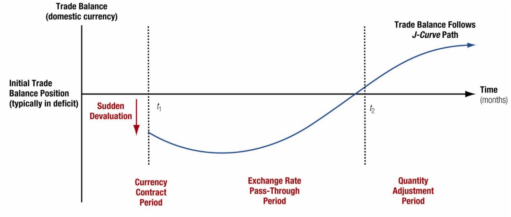

# Introduction

Random Quote: **Ships are always safe at ports. But that is not what they were made for.**

Quote for the chapter: **When goods don’t cross borders, soldiers will.**  
— commonly attributed to Frédéric Bastiat

> The measurement of all international economic transactions between the residents of a country and foreign residents is called the **balance of payments (BOP)**.

This chapter gives you the accounting “dashboard” for the international economy. The BOP is not just a record-keeping exercise—it is the bridge between **trade flows**, **capital flows**, and the “big three” macro issues that dominate international finance: **exchange rates, interest rates, and inflation**.

## Chapter Roadmap {.unnumbered}

Major sections:

1. **Fundamentals of BOP Accounting** — What counts as an international transaction, and why does the BOP always balance?
2. **The Accounts of the Balance of Payments** — Current account, capital/financial account, errors & omissions, and reserves.
3. **BOP Impacts on Key Macroeconomic Rates** — How BOP pressures translate into exchange-rate, interest-rate, and inflation outcomes.
4. **Trade Balances and Exchange Rates** — Why devaluations often “hurt first, help later” (the J-curve).
5. **Capital Mobility** — How open (or closed) capital markets reshape crisis risk and policy choices.

### BOP data are important fo the following reasons: {.unnumbered}

1. The BOP is an important indicator of pressure on a country's foreign exchange rate and thus of the potential for a firm trading with or investing in that country to experience foreign exchange gains or losses. Changes in the BOP may predict the imposition or removal of foreign exchange controls.

2. Changes in a country's BOP may signal the imposition or removal of controls over payment of dividends and interest, license fees, or other cash disbursements to foreign firms or investors.

3. The BOP helps to forecast a country's market potential, especially in the short run. A country experiencing a serious trade deficit is not as likely to expand imports, as it would be if running a surplus. It may, however, welcome investments that increase its exports.

------------------------------------------------------------------------

## Fundamentals of BOP Accounting

A BOP statement is fundamentally a **statement of cash flows over an interval of time**. 

The main elements of the actual process of measuring international economic activity:

1. Identifying what is and is not an international economic transaction.
2. Understanding how the flow of goods, services, assets, and money creates debits and credits to the overall BOP.
3. Understanding the bookkeeping procedures for BOP accounting.

A good rule of thumb: **Follow the cash flow.**  
Who *pays* whom? In what currency? For what? And who is the **resident**?

### Defining International Economic Transactions

**An international economic transaction** occurs whenever there is an exchange of real or financial resources between **residents** of a country and **nonresidents**.

- **Residence is economic, not citizenship.**  
  A French citizen living and working in Texas is a U.S. *resident* for BOP purposes; a U.S. citizen working in London is a UK *resident*.

- **What counts (typical examples):**
  - U.S. tourist buys a leather jacket in Italy → U.S. **import of goods** (current account).
  - A U.S. subsidiary pays dividends to a foreign parent → **income payment** (current account).
  - A Canadian investor buys a U.S. corporate bond → **portfolio inflow** (financial account).

- **What does *not* count:**  
  Domestic transactions between two U.S. residents—even if the good was imported earlier.  
  Example: buying a Korean-made TV at a Florida Walmart is **not** a BOP transaction at the moment of purchase; the import was recorded when the good crossed the border.

**Managerial relevance (why a multinational cares):**
- BOP signals **pressure on exchange rates** (potential FX gains/losses).
- BOP changes can foreshadow **capital controls** or restrictions on profit repatriation.
- Current-account stress often predicts **policy tightening** and weaker short-run market potential.

### The BOP as a Flow Statement

The BOP is a **flow statement** (like an income statement or cash-flow statement), not a stock statement.

- **Flow:** “What happened during the year/quarter?”  
- **Stock (contrast):** “What is the value today?” (that’s more like the **international investment position (IIP)** concept).

This matters because a country can run repeated current-account deficits for years (flows), accumulating a growing net debtor position (stocks).

Two types of business transactions dominate the BOP:

**1. Exchange of real assets** The exchange of good (e.g., automobiles, computers, textiles) and services (e.g., banking, consulting, and travel services) for other goods and services (barter) or for money.

**2. Exchange of financial assets** The exchange of financial claims (e.g., stocks, bonds, loans, and purchases of sales of companies) for other financial claims or money.

### BOP Accounting

BOP uses **double-entry bookkeeping**. Every transaction is recorded twice:

- A **credit (+)** is an inflow of foreign exchange (or an item that *supplies* foreign currency to the country).  
  Examples: exports, foreign investment inflows.

- A **debit (−)** is an outflow of foreign exchange (or an item that *demands* foreign currency).  
  Examples: imports, residents acquiring foreign assets.

**Key implication:** the overall BOP must sum to **zero** *after* including “errors and omissions” and official reserves.

#### A double-entry example

Suppose a U.S. firm exports $10m of machinery to Brazil, paid in USD deposited in a U.S. bank.

| Entry | Account | Credit/Debit | Amount |
|---|---|---:|---:|
| Export of goods | Current account (goods) | Credit | +$10m |
| Increase in bank deposit liability to foreign resident | Financial account (other investment) | Debit* | −$10m |

\*Depending on reporting conventions, the matching financial entry can be described as the foreigner **acquiring a U.S. financial asset** (a claim on a U.S. bank). The essential point: the current-account credit is matched by an equal-and-opposite financial-account entry.

------------------------------------------------------------------------

## The Accounts of the Balance of Payments

The BOP has three major sub-accounts:

1. **Current account** 
2. **Capital account**
3. **Financial accounts** 

Then add two “balancing/operational” accounts:

- **Net errors and omissions** (statistical discrepancy)
- **Official reserves** (central bank actions, especially under fixed/managed regimes)

### The Current Account

The **current account** includes international transactions where income/payment flows occur within the current period (often defined as within one year). It has four main subcategories:

1. **Goods trade** - merchandise trade, this is the most basic and largest for most countries
2. **Services trade** - Common internationals services are financial services provided by banks to foreign importers and exporters, travel (airlines), etc. This has had the fastest growth in the past decade.
3. **Income** (investment income, compensation, etc.)  
4. **Current transfers** (unilateral transfers: remittances, some aid, etc.) Money sent back to home countries from migrant workers appear here.

A helpful simplification:

- **Balance of trade (BOT)** is typically just **goods exports − goods imports**.  
  (The press often uses “trade balance” loosely; the textbook’s BOT focus is goods.)

Merchandise trade is the core of international trade and is the basis for the Industrial Revolution and the Theory of Comparative Advantage.

Declines in the US BOT attributed to specific sectors, such as steel, automobiles, automotive parts, textiles, and shoe manufacturing, caused massive economic and social disruption.

Understanding merchandise import and export performance is much like understanding the market for any single product. The demand factors that drive both are income, the economic growth rate of the buyer, and price of the product in the eyes of the consumer after passing through an exchange rate. As income rises, so does the demand for imports. US manufacturing exports depend not on the incomes of US residents, but on the incomes of buyers of US products globally.

### The Capital and Financial Accounts

The **capital account** (as defined in modern IMF presentation) is usually small for most countries; it includes:

- Transfers of financial assets (e.g., debt forgiveness in some cases)
- Acquisition/disposal of **nonproduced/nonfinancial assets** (e.g., some intellectual property rights), the capital account is relatively minor.

For most macro discussions in this course, the **financial account** carries the action.

### Financial Account

The financial account records transactions in financial assets and is commonly split into:

- **Direct investment**
- **Portfolio investment**
- **Net financial derivatives**
- **Other investment (other asset investment)**

The financial account classifies assets primarily by **degree of control** (not by maturity).

#### Direct Investment

**Direct investment** is cross-border investment intended to exert meaningful influence/control over operations—often proxied by a threshold such as **10% ownership**. This is very important.

**Two recurring political-economy concerns:**

- **Control:** Who governs strategic assets, technology, decision rights?
- **Profit repatriation:** Who receives the income stream, and can it be remitted?

**Examples:**
- Foreign automaker builds a plant in Tennessee → inward FDI (financial-account inflow).
- U.S. firm acquires a foreign subsidiary → outward FDI (financial-account outflow).

**Important Clarification**

1. "The choice of words used to describe foreign investment can also influence public opinion. If these massive capital inflows are described as "capital investments from all over the world demonstrating faith in the future of US industry," the net capital surplus is represented as decidedly positive. If, however, the net capital surplus is described as resulting in "the United States being the world's largest debtor nation," the negative connotation is obvious. Both are essentially spins on the same economic principles at work."

2. "Capital, whether short-term or long-term, flows to where the investor believes it can earn the greatest return for the level of risk. And although in an accounting sense this is "international debt," when the majority of the capital inflow occurs in the form of direct investment, a long-term commitment to jobs, production, services, technological, and other competitiveness of industry located within a country is increased."

3. When a foreign entity puts money into the US, they are buying claims on US assets (some type of investment) which creates a liability for the US. The US is required to pay back the investment at some point in the future, or at least the income derived from the investment. It is not "technically" borrowing, the US is not asking for the funds in order for the US to do something. However, the MNE must convert their currency to US dollars to build within the US.

Whether this is a good thing or bad thing for the US (or home economy) is how we use the invested funds. If we use them to build productive investments (capital goods or something that raises future output) that is good. However, if we use the investment only to finance current consumption without productive capabilities, that would be bad. 

#### Portfolio Investment

**Portfolio investment** is cross-border investment without control—motivated primarily by **return**.

- Equity purchases below the direct-investment threshold **(10%)**
- **Debt securities** (bonds) are classified as portfolio because they do not convey control by design.

Portfolio flows are typically **more volatile** than FDI and are often central in currency crises.

#### Other Asset Investment

“Other investment” is the residual category and often includes:

- Bank lending and deposits
- Trade credit
- Short-term claims and liabilities not captured elsewhere

This category can surge during credit booms and collapse during “sudden stops.”

**Important Note:** The current account and financial account should net to zero, or at least be should be close.

$$
\text{Current Account} + \text{Financial Account} = 0
$$
Think about it this way: the Current Account is the "stuff" purchased or sold, and the Financial Account is the payment made or received for the "stuff".

### Net Errors and Omissions and Official Reserves Accounts

Even with double-entry bookkeeping, real-world measurement is messy.

#### Net Errors and Omissions Account

**Errors and omissions** reconcile measured credits and debits when:

- Transactions are mismeasured, misclassified, or unreported
- Timing mismatches occur
- Informal/illegal flows exist (e.g., capital flight, some illicit finance)

A large and persistent discrepancy is often a warning sign: either the data are weak, or the economy is experiencing untracked flows.

#### Official Reserves Account

The **official reserves account** tracks reserve assets held by the monetary authority (foreign exchange, gold, SDRs, reserve positions, etc.).

Its importance depends on the currency regime:

- Under **fixed exchange rates**, reserves are central—the government must buy/sell reserves to keep the peg.
- Under **floating rates**, reserves matter less for maintaining a level, but may matter for liquidity, crisis insurance, or “leaning against the wind.”
- Under **managed floats**, reserves are often used tactically to influence the exchange rate path.

### Breaking the Rules: China’s Twin Surpluses

Normally, the current account and financial account are **inversely related**:

- Current-account deficit tends to pair with financial-account surplus (capital inflow finances the deficit).
- Current-account surplus tends to pair with financial-account deficit (capital outflow “invests” the surplus abroad).

China has periodically exhibited a **twin surplus**—surpluses in both the current and financial accounts—paired with large reserve accumulation. The key ingredients are typically:

- High saving relative to investment (supporting current-account surplus)
- Strong growth prospects attracting inflows
- Administrative controls and sterilization policies enabling sustained reserve buildup

This has also been caused by China's rigid capital outflow restrictions, that limit the amount of capital that can leave the country.

------------------------------------------------------------------------

## BOP Impacts on Key Macroeconomic Rates

International finance links the BOP to three macro prices:

- **Exchange rates**
- **Interest rates**
- **Inflation rates**

A useful identity-style representation is:

\[
BOP = (X - M) + (CI - CO) + (FI - FO) + FXB
\]

Where:

**Current Account** - \(X, M\): exports and imports (goods + services)

**Capital Account** - \(CI, CO\): capital inflows/capital outflows

**Financial Account** - \(FI, FO\): financial inflows/financial outflows

**Reserve Balance** - \(FXB\): change in official reserves (conceptually, the balancing item in many regime discussions)

### The BOP and Exchange Rates

BOP pressure is fundamentally **pressure on the currency market**.

- A deficit implies net demand for foreign currency (net supply of domestic currency).
- A surplus implies net demand for domestic currency (net supply of foreign currency).

How that pressure translates into outcomes depends on the regime.

#### Fixed Exchange Rate Countries

Under a **fixed exchange rate**, the government commits to a parity. Therefore:

- The monetary authority must **intervene** (buy/sell reserves) to keep the peg.
- Persistent deficits can deplete reserves → crisis risk → devaluation or capital controls.

Rule of thumb:  
If the private-sector transactions don’t sum near zero, **official reserves must move to stabilize the peg or will be forced to devalue the currency**.

#### Floating Exchange Rate Countries

Under a **floating rate**, the government does not promise a parity.

- The exchange rate adjusts to equilibrate supply/demand in FX markets.
- BOP “imbalance” shows up as **currency depreciation/appreciation**, not necessarily reserve loss. (In other words, any imbalance will be adjusted by a change in the value of the currency relative to other currencies. This may take time, which is known as the "J-Curve".)

In practice, even floaters watch the current and financial accounts because they signal medium-run pressures and vulnerability. As with other things, more volatility signals instability, which translates to more risk.

#### Managed Floats

A managed float sits between fixed and floating:

- Authorities allow some movement but intervene to limit volatility or steer competitiveness.
- Reserve accumulation (or depletion) is common.
- Policy instruments often include both **intervention** and **interest-rate policy**.

**Focus is on Capital Inflows and Outflows**:

A change in the interest rates will alter the capital account balance, especially the short-term portfolio component of these capital flows, that should correct any "imbalance" in the current account.

Remember the effects of raising interest rates: Increased rates attract foreign capital to the domestic country. The downside is that it increases the costs of local domestic borrowing.

### The BOP and Interest Rates

Interest rates are a primary channel through which countries attract or repel financial flows.

- Lower real interest rates normally encourage **capital outflows** (the capital search for yield).
- Higher real interest rates normally attract **capital inflows** (carry trades, bond demand).

However, risk and growth prospects can dominate yield:
- The United States has often attracted inflows even with relatively low real rates due to perceived safety, depth of markets, and growth/innovation expectations.

Financial-account inflows can **finance** current-account deficits and **temper** interest-rate pressure—but if confidence shifts, the reversal can be abrupt.

### The BOP and Inflation Rates

Imports can affect inflation through competition and prices:

- Cheaper imports can restrain domestic pricing power → lower inflation.
- But import competition can reduce domestic output/employment in affected sectors, worsening the current account through lower export capacity or higher import dependence.

------------------------------------------------------------------------

## Trade Balances and Exchange Rates

Exchange-rate changes alter **relative prices**, which then change **quantities** through price elasticities.

The adjustment of the trade balance following a depreciation/devaluation typically unfolds in stages.

### Trade and Devaluation

A depreciation (floating) or devaluation (fixed) makes:

- Imports **more expensive** in domestic currency
- Exports **cheaper** in foreign currency

But the trade balance may initially **worsen** because quantities adjust slowly.

### The J-Curve Adjustment Path

The J-curve is the classic “it gets worse before it gets better” story. Adjustment tends to occur in three stages:

1. **Currency contract period** (contracts already set; quantities fixed)  
2. **Pass-through period** (exchange-rate change passes into import/export prices)  
3. **Quantity adjustment period** (consumers and firms change behavior; quantities respond)

Typical classroom timing heuristic: each stage can take **months**, not weeks.

**Here is the flow of the J-curve over time:**

{width="75%"}

### Trade Balance Adjustment Path: The Equation

Think of the trade balance in domestic currency:

$$
TB = \left( P_X^{\$} Q_X \right) - \left( S^{\$/fc} \cdot P_M^{fc} Q_M \right)
$$

Where:

- $P_X^{\text{\$}}$: export price in domestic currency  
- $Q_X$: export quantity  
- $P_M^{fc}$: import price in foreign currency  
- $Q_M$: import quantity  
- $S^{\text{\$/}fc}$: spot exchange rate (domestic per unit foreign)

Immediate depreciation raises $S^{\$/fc}$, mechanically raising the domestic-currency value of imports—before $Q_M$ has time to fall.

------------------------------------------------------------------------

## Capital Mobility

Capital mobility is the degree to which financial capital can move across borders.

A core empirical regularity in many advanced economies:
- **Current-account deficits** are often offset by **financial-account surpluses** (inflows).

In crisis episodes, however, the financial account can reverse suddenly (“sudden stop”), forcing rapid current-account adjustment via recession and depreciation.

### Current Account versus Financial Account Capital Flows

Two sides that go together:

- **Trade/real-side:** current account reflects saving vs investment and trade competitiveness.
- **Finance side:** financial account reflects portfolio preferences, risk, expected returns, and institutional credibility.

They are linked by accounting identity, but **driven by different behavioral margins**.

### Historical Patterns of Capital Mobility

Economic history can be divided into eras where openness and constraints differed markedly.

#### Classical Gold Standard (1870-1914)

- Gold convertibility underpinned confidence
- Capital mobility rose alongside trade expansion
- Trade often dominated capital flows early; integration deepened over time

#### Interwar Years (1923-1938)

- Protectionism, nationalism, and policy instability
- Severe restrictions on trade and capital
- Capital mobility collapsed

#### Fixed Exchange Rates (1944-1973)

- Bretton Woods system supported trade expansion
- Capital mobility grew but was managed; current-account convertibility emphasized

#### Floating Exchange Rates (1973-1997)

- Greater exchange-rate volatility
- Rapid growth in cross-border capital flows
- Capital flows increasingly dominated trade flows

#### The Emerging Era (1997-Present)

- Emerging markets opened selectively
- Crises (1997/98, 2008, and beyond) shaped openness debates
- China and India illustrate strategic, gradual opening with controls

### Capital Controls

A **capital control** is any restriction that limits or alters the rate or direction of capital movement into or out of a country.

Common motives:
- Prevent or slow **capital flight**
- Reduce vulnerability to volatile short-term inflows/outflows
- Preserve monetary autonomy or exchange-rate objectives

**Dutch Disease** (classic example):  
Resource windfalls can trigger capital inflows and currency appreciation, harming other tradable sectors and “crowding out” manufacturing competitiveness.

### Globalization of Capital Flows

Modern globalization means:

- Very large gross flows can occur even when net flows are modest.
- Financial markets can transmit shocks quickly (contagion).
- Short-term flows can reverse faster than policy can respond—raising the value of reserves, swap lines, and credible policy frameworks.

------------------------------------------------------------------------

## Conclusion

### Five Key Lessons

1. **BOP is a cash-flow accounting framework**—it measures international transactions over time.
2. **The BOP must balance** (with errors/omissions and reserves), but subaccounts can swing widely.
3. **Current vs financial accounts**: trade/income flows versus asset/claim flows—different drivers, same identity.
4. **Regimes matter**: fixed rates shift adjustment to reserves and policy; floats shift adjustment to the exchange rate.
5. **Dynamics matter**: trade balance reacts slowly (J-curve), while capital flows can reverse quickly (sudden stops).

### Questions to think about:

1. Why might a country *want* to run a sustained current-account deficit? Under what conditions is it sustainable?
2. What makes portfolio flows more crisis-prone than direct investment?
3. In a fixed-rate regime, which breaks first in a persistent deficit: domestic interest rates, reserves, or the peg?
4. When might capital controls be welfare-improving, despite efficiency costs?
5. How do you reconcile the accounting identity (BOP balances) with real-world “imbalances” discussed in the media?
