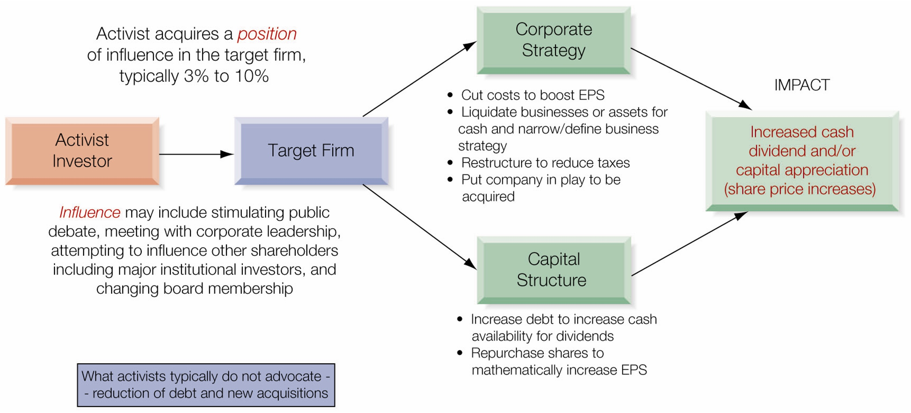

# Introduction

Random Quote: **A student asked his master, "You talk about peace, but you only teach me to fight. How do you reconcile the two?" The master replied, "It is better to be a warrior in a garden, than a gardener in a war."**

Scripture: **"I am sending you out like sheep among wolves. Therefore be as shrewd as snakes and as innocent as doves. Be on your guard;"** - Matthew 10:16-17a

Quote: **"A Corporation then, or a body politic, or body incorporate, is a collection of many individuals united into one body, under a special denomination, having perpetual succession under an artificial form."**

— Stewart Kyd, *A Treatise on the Law of Corporations*, 1793

> Global business is conducted by many different types of organizations for many different purposes. Although it may appear at times that global business is dominated by the publicly traded corporation and for the sole purpose of profit, these are characteristic of only select companies, countries, and markets, and the global marketplace is much more diverse and complex.

## Chapter Roadmap {.unnumbered}

Major sections:

1.  **Business Ownership** — Who owns businesses globally and what are the implications?
2.  **The Corporate Objective** — Shareholder capitalism vs. stakeholder capitalism
3.  **Corporate Governance** — How are corporations directed and controlled?
4.  **The Market for Corporate Control** — Mergers, acquisitions, and takeover defenses

------------------------------------------------------------------------

## Learning Objectives {.unnumbered}

By the end of this chapter, you should be able to:

-   Examine the different ownership structures for businesses globally and how this impacts the separation between ownership and management—the agency problem
-   Compare and contrast the two dominant theories of the corporate purpose: shareholder capitalism and stakeholder capitalism
-   Consider the differences in corporate governance regimes globally, including their ability to allow the market for corporate control to evaluate and discipline corporate performance
-   Explore the market for corporate control, the global marketplace for merging or acquiring control over corporate resources, and the multitude of strategies and tactics used to both effect and defend against hostile acquisitions

------------------------------------------------------------------------

## Business Ownership

We begin our discussion of corporate financial goals by asking two basic questions:

1.  **Who owns the business?**
2.  **Do the owners of the business manage the business themselves?**

In global business today, the ownership and control of organizations varies dramatically across countries and cultures. To understand how and why those businesses operate, one must first understand the many different ownership structures.

### Types of Ownership

The terminology associated with the ownership of a business can be confusing. Let's clarify the key distinctions:

#### Public vs. Private Enterprise

| Term | Definition |
|------------------------|-----------------------------------------------|
| **Public Enterprise** | A business owned by a government or the state; also called a State-Owned Enterprise (SOE) |
| **Private Enterprise** | A business owned by a private individual or organization |
| **Privately Held** | A business owned by a private party or small group of private individuals |
| **Publicly Traded** | A firm whose shares are listed and traded on a stock exchange |

**Key Insight:** A second distinction on ownership clouds the terminology. A business owned by a private party is termed *privately held*. If those owners wish to sell a portion of their ownership in the business in the capital markets—for example, by listing and trading the company's shares on a stock exchange—the firm's shares are then said to be *publicly traded*.

#### Hybrid Ownership Structures

In the world today, there are a multitude of hybrid ownership structures that could alter the financial objectives of firms:

-   Both public and private enterprises may have a portion of their ownership publicly traded
-   The public shares, however, often represent less than 50% ownership
-   Businesses may be owned in whole or in part by families and may be operated for profit or not for profit

#### Ownership Examples

The following three multinational enterprises illustrate how ownership differs in global business:

**Petrobras (Brazil)**

-   National oil company of Brazil, founded in 1953
-   Originally 100% state-owned enterprise
-   Eventually became publicly traded on the São Paulo stock exchange
-   Today: Brazilian government owns **64%** of shares; **36%** held by private investors worldwide
-   *Example of:* State-owned enterprise with partial public trading

**Apple (United States)**

-   Founded in 1976 as a partnership (Steve Jobs, Steve Wozniak, Ronald Wayne)
-   Incorporated in 1977
-   IPO in 1980 on NASDAQ
-   Today: Considered **widely held** with no single investor holding 5% of shares
-   Periodically the world's most valuable publicly traded company by market capitalization
-   *Example of:* Widely held, publicly traded corporation

**Hermès International (France)**

-   French multinational producer of luxury goods, founded in 1837
-   Owned and operated by the Hermès family for most of its history
-   IPO in 1993: sold 27% to the general public
-   Family retained **73%** ownership and control
-   *Example of:* Family-controlled, publicly traded company

#### Understanding Ownership and Control

Once the ownership of the business is established, it is easier to understand where **control** lies, as ownership and control are separate concepts:

| Company | Status | Control |
|-------------------------|----------------------|-------------------------|
| Petrobras | Publicly traded Brazilian business | Controlled by Brazilian government |
| Hermès | Publicly traded French business | Controlled by Hermès family |
| Apple | Publicly traded, widely held | Control rests with board of directors and senior leadership |

**Important:** Any business, whether initially owned by the state, a family, or a private individual or institution, may choose to have a portion of its ownership traded as shares in the public marketplace. A 100% publicly traded firm can no longer be either state-owned or privately held by definition.

#### Going Public and Going Private

**Initial Public Offering (IPO):** If a firm's owners decide to sell a portion of the company to the public, it conducts an IPO. Typically only a small percentage of the company is initially sold to the public, anywhere from 10% to 20%.

**Going Private:** A private owner or family may choose to retain a major share but may not retain control. It is also possible for the controlling interest in a firm to reverse its public share position, reducing the number of shares outstanding by repurchasing shares.

*Example:* In 2005, Koch Industries (U.S.), a very large private firm, purchased all outstanding shares of Georgia-Pacific (U.S.), a very large publicly traded company. Koch took Georgia-Pacific private.

#### Implications of Going Public

When a firm becomes publicly traded, it becomes subject to many increased legal, regulatory, and reporting requirements:

-   Must disclose a sizable degree of financial and operational detail
-   Publish this information at least quarterly
-   Comply with all the rules and regulations of the SEC and exchange on which its shares are traded

**Note:** In most countries, firms which are privately held do not have to publish detailed financial and operating results.

### The Corporation

A **corporation** is an organization, typically a group of people or companies, recognized legally by the state to act as a single entity. This is often described as a **legal person**.

#### Characteristics of a Corporation

As a legal person, the corporation has many of the same rights and attributes of individuals:

-   Can enter into contracts
-   Take out loans
-   Sue and be sued
-   Purchase or sell assets

#### Limited Liability

A very important benefit of the corporate form is that shareholders have **limited liability**:

-   Shareholders may only lose financially what they have invested
-   They do not have personal liability
-   This feature is often seen as an incentive for shareholders to undertake greater risks

#### Complexities of the Corporate Form

**First complexity:** Shareholders are financial investors, not truly owners in the traditional sense:

-   Shareholders are not privy to the internal workings of the firm
-   They cannot sign contracts on behalf of the firm
-   They cannot purchase or sell assets on behalf of the firm
-   As financial investors and not operators, they are primarily interested in financial returns

**Second complexity:** The corporation is a legal person, an artificial person, not an actual person. This has led to a recurring debate over whether the corporation has social interests or a conscience or whether it is purely an organization for financial profit.

### Separation of Ownership and Management

One of the most challenging issues in the financial management of the corporation or enterprise is the possible separation of ownership from management.

#### The Agency Problem

Hired or professional management may be present under any ownership structure, though most common in SOEs and publicly traded companies. This separation of ownership from management raises the possibility that the two entities may have:

-   Different business and financial objectives
-   Different risk tolerances or appetites (from a purely financial perspective)

This is the so-called **principal-agent problem** or simply the **agency problem**.

As Adam Smith wrote in *The Wealth of Nations* (1776):

> "The directors of such \[joint-stock\] companies, however, being the managers rather of other people's money than of their own, it cannot well be expected, that they should watch over it with the same anxious vigilance with which the partners in a private copartnery frequently watch over their own."

#### Examples of Agency Issues

-   **Management as agent:** Management is hired as an agent of the shareholder to represent the shareholder's interests
-   **Risk tolerance mismatch:** Shareholders, benefiting from the corporate form, are interested in the firm taking significant risks in search of profits. Managers, dependent on the continuing operation of the corporation for their livelihood, may be reluctant to take excessive risk

------------------------------------------------------------------------

## The Corporate Objective?

**What is the purpose of the corporation?**

The purpose of the corporation might be first defined as "to run a business." That business is in turn a system of mission, vision, and strategy. Depending on your field of study and perspective, the purpose of the corporation may be to:

-   Enrich customers
-   Provide jobs
-   Generate wealth for shareholders
-   Create value for stakeholders
-   Increase the welfare of society

The **financial objective** of the firm, of specific interest to us in the field of financial management, might then be viewed as the metric of performance in the conduct of that business.

### The Two Dominant Forms of Capitalism

Companies today, whether domestic firms or multinational enterprises, are in the midst of a growing debate as to whom the corporation specifically serves. Assuming a market economy and a focus on for-profit organizations, the two most widely accepted forms of capitalism are:

1.  **Shareholder Capitalism** (also called Shareholder Wealth Maximization or SWM)
2.  **Stakeholder Capitalism** (also called the Stakeholder Capitalism Model or SCM)

### Understanding Stakeholders

A **stakeholder** is any entity with an interest, right, or concern with an organization and its activities.

**Direct Stakeholders** — Entities with a vested financial interest in the firm's success:

-   *Business stakeholders:* Suppliers and customers
-   *Internal stakeholders:* Employees and management
-   *Financial stakeholders:* Equity investors (shareholders) and creditors

**Indirect Stakeholders** — Entities impacted in some way by the firm's activities:

-   Community
-   Government
-   Civil society
-   Environment

### Shareholder Capitalism

As the Michigan State Supreme Court stated in *Dodge v. Ford Motor Company* (1919):

> "A business corporation is organized and carried on primarily for the profit of the stockholders. The powers of the directors are to be employed for that end. The discretion of directors is to be exercised in the choice of means to attain that end, and does not extend to a change in the end itself, to the reduction of profits, or to the non-distribution of profits among stockholders in order to devote them to other purposes."

**Definition of Shareholder Wealth Maximization (SWM)**

The Anglo-American markets have a philosophy that a firm's objective should follow **shareholder capitalism**, also frequently termed **shareholder wealth maximization (SWM)**.

More specifically, the firm should strive to:

-   Maximize the financial returns to shareholders, as measured by the sum of capital gains and dividends, for a given level of risk
-   Alternatively, minimize the risk to shareholders for a given rate of return
-   Do so in preference to the interests and returns to all other stakeholders of the firm

#### Market Efficiency

The SWM theoretical model assumes, as a universal truth, that the **stock market is efficient**. This means:

-   The share price is always correct because it captures all the expectations of return and risk as perceived by investors
-   It quickly incorporates new information into the share price
-   Share prices, in turn, are deemed the best allocators of capital in the macro economy

#### Risk

The SWM model also treats its definition of risk as a universal truth:

**Systematic Risk:**

-   The risk of the market in general
-   Cannot be eliminated through portfolio diversification
-   The share price will be a function of the stock market

**Unsystematic Risk:**

-   The risk of the individual security
-   The operational risk associated with the business line of the individual firm
-   Can be eliminated through portfolio diversification by investors
-   Should not be a prime concern for management unless it increases the possibility of bankruptcy

#### Agency Theory

**Agency theory** is the study of how shareholders can motivate management to accept the prescriptions of the SWM model.

**Tools for aligning interests:**

-   Liberal use of stock options should encourage management to think like shareholders
-   If management deviates from SWM objectives, it is the responsibility of the board to replace management
-   In cases where the board is too weak or ingrown to take this action, the discipline of equity markets could do it through a takeover

**Key mechanism:** This discipline is made possible by the **one-share-one-vote rule** that exists in most Anglo-American markets.

#### Long-Term versus Short-Term Value Maximization

During the 1990s, the economic boom and rising stock prices exposed a flaw in the SWM model, especially in the United States.

**The Problem:**

-   Instead of seeking long-term value maximization, several large U.S. corporations sought short-term value maximization
-   This was partly motivated by the overly generous use of stock options to motivate top management
-   The continuing debate about meeting the market's expected quarterly earnings

**Consequences:**

Firms such as Enron, Global Crossing, HealthSouth, Adelphia, Tyco, Parmalat, and WorldCom undertook risky, deceptive, and sometimes dishonest practices for the recording of earnings and/or obfuscation of liabilities, which ultimately led to their demise.

**Impatient vs. Patient Capitalism:**

| Type | Description |
|-----------------------|-------------------------------------------------|
| **Impatient Capitalism** | Short-term focus on the part of both management and investors; destructive short-term thinking |
| **Patient Capitalism** | Focuses on long-term shareholder wealth maximization |

*Example:* Legendary investor Warren Buffett, through his investment vehicle Berkshire Hathaway, represents one of the best of the patient capitalists. Buffett has become a billionaire by focusing his portfolio on mainstream firms that grow slowly but steadily with the economy, such as Coca-Cola.

### Stakeholder Capitalism

As Frank W. Abrams, Chairman of Standard Oil of New Jersey, stated in 1951:

> "The job of management is to maintain an equitable and working balance among the claims of the various directly interested groups... stockholders, employees, customers, and the public at large."

**Characteristics of Stakeholder Capitalism**

In the non-Anglo-American markets, controlling shareholders also strive to maximize long-term returns to equity. However, they are more constrained by other powerful stakeholders:

-   Labor unions are more powerful
-   Governments interfere more in the marketplace to protect important stakeholder groups (local communities, the environment, employment)
-   Banks and other financial institutions are more important creditors than securities markets

#### Market Efficiency

Stakeholder capitalism **does not assume** that equity markets are either efficient or inefficient.

-   It does not really matter because the firm's financial goals are not exclusively shareholder-oriented since they are constrained by other stakeholders
-   The SCM model assumes that long-term "loyal" shareholders, typically controlling shareholders, should influence corporate strategy rather than the transient portfolio investor

#### Risk

The SCM model assumes that **total risk**, that is, operating risk, does count.

-   It is a specific corporate objective to generate growing earnings and dividends over the long run with as much certainty as possible
-   Risk measurement is based more on product market variability than on short-term variation in earnings and share price

#### Single versus Multiple Goals

Although the SCM model typically avoids a flaw of the SWM model—impatient capital that is short-run oriented—it has its own flaw:

-   Trying to meet the desires of multiple stakeholders leaves management without a clear signal about the trade-offs
-   Management tries to influence the trade-offs through written and oral disclosures and complex compensation systems

#### The Scorecard

In contrast to the SCM model, the SWM model requires a **single goal of value maximization** with a well-defined scorecard.

According to the theoretical model of SWM, the objective of management is to **maximize the total market value of the firm**. This means corporate leadership should be willing to spend or invest more if each additional dollar creates more than one dollar in the market value of the company's equity, debt, or any other contingent claims on the firm.

### Events Renewing the Debate

| Period | Event | Implication |
|---------------------|------------------|---------------------------------|
| 1990s | Non-Anglo-American markets privatized industries | Shareholder wealth focus needed to attract international capital |
| 2008-2010 | Global financial crisis | Demonstrated major income and employment inequalities; civil society called for stakeholder capitalism |
| 2010-present | Focus on environmental and social concerns | Climate change, global pandemic inequities—concerns more aligned with stakeholder capitalism |

### Environmental, Social, and Governance (ESG)

Environmental, social, and governance (ESG) concerns are today an everyday topic in global business.

**Shareholder capitalist argument:**

-   The corporation is not a real human and has no specific conscience or social value judgments
-   Only the leaders of the publicly traded firm are humans, and it is not appropriate for those leaders to impose their own values on the corporation
-   In the process of maximizing value for the shareholder, the entire pie is enlarged for all stakeholders

As Milton Friedman (Uncle Milty), Nobel Prize-winning economist, stated:

> "There is one and only one social responsibility of business—to use its resources and engage in activities designed to increase its profits so long as it stays within the rules of the game, which is to say, engages in open and free competition without deception or fraud."

**Stakeholder capitalist argument:**

-   The corporation is a legal person and is obligated to benefit all of its stakeholders, including society, and not just shareholders

### Stakeholder Capitalism Metrics: The Four Ps

The World Economic Forum (WEF) believes that if businesses are to thrive, companies need to enhance their license to operate through greater commitment to long-term sustainable value creation. The WEF identifies four themes (the 4Ps):

1.  **Principles of Governance:** Governing purpose, quality of governing, stakeholder engagement, ethical behavior, risk and opportunity oversight
2.  **Planet:** Climate change, nature loss, freshwater availability
3.  **People:** Dignity and equality, health and well-being, skills for the future
4.  **Prosperity:** Employment and wealth generation, innovation of better products and services, community and social vitality

### Operational Goals

The management objective of maximizing profit is not as simple as it sounds because the measure of profit used by ownership/management differs between the private firm and the publicly traded firm.

**Key Question:** Is management attempting to maximize current income, capital appreciation as in a share price, or both?

#### Returns to Investors in Publicly Traded Firms

The return to a shareholder in a publicly traded firm combines:

1.  **Current income** in the form of dividends
2.  **Capital gains** from the appreciation of share price

$$
\text{Shareholder Return} = \frac{D_2}{P_1} + \frac{P_2 - P_1}{P_1}
$$

Where:

-   $P_1$ = Beginning price (initial investment by shareholder)
-   $P_2$ = Price of share at end of period
-   $D_2$ = Dividend paid at end of period

**Example:** In the United States in the 1990s, a diversified investor may have received an average annual return of 14%: 2% from dividends and 12% from capital gains. This "split" differs dramatically across the world's major markets over time.

**Management's Influence on Returns**

-   **Dividend yield:** Management generally believes it has the most direct influence over this component. Management makes strategic and operational decisions that grow sales and generate profits, then distributes those profits to ownership in the form of dividends.
-   **Capital gains:** Much more complex and reflects many forces not under management control. Despite growing market share, profits, or any other traditional measure of business success, the market may not reward these actions directly with share price appreciation.

**Bottom line:** Leadership in the publicly traded firm typically concludes that its own growth—growth in top-line sales and bottom-line profits—is its greatest hope for driving share price upward.

### The Case of Apple

In March 2012, Apple announced it would end a 17-year period of no dividend payments. This was followed by a similarly shocking announcement in April 2013 that it would raise nearly \$17 billion in debt, although the company had an enormous cash balance.

**Understanding the Policy Change:**

One way to understand the financial policy change is to consider whether Apple had grown and evolved from a **growth firm** to a **value firm**.

| Type | Characteristics |
|-------------------|----------------------------------------------------|
| **Growth Firms** | Small to medium-sized firms in early rapid growth stages; value growing rapidly; share prices rising; need all capital for growth; debt often viewed as slowing agility |
| **Value Firms** | Large, mature businesses; difficult to create material value changes; share price movements slower and more subtle; generate massive cash flow; may face pressure from activists to pay dividends and take on debt |

**Tax Considerations:**

In Apple's case, there was an additional issue: Although the company held massive cash balances, this cash was largely offshore. Returning it to the U.S. would result in large tax obligations. Apple chose to issue debt to fund newly declared cash dividends rather than repatriate offshore cash.

### Returns to Owners of Privately Held Firms

A privately held firm has a much simpler shareholder return objective function: **maximize current and sustainable financial income to its owners**.

-   The privately held firm does not have a share price
-   It does have a value, but this is not a definitive market-determined value
-   It focuses on generating current financial income, dividend income (as well as salaries and other forms of income provided owners)

**Family Ownership Considerations:**

-   The family may place great emphasis on the ability to sustain earnings over time while maintaining a slower rate of growth
-   Without a share price, "growth" is not of the same strategic importance
-   The privately held firm may be less aggressive (take fewer risks) than the publicly traded firm

**Research Finding:** A recent McKinsey study found that privately held firms consistently used significantly lower levels of debt (averaging 5% less debt to equity) than publicly traded firms. Interestingly, these same private firms also enjoyed a lower cost of debt (roughly 30 basis points lower).

#### Exhibit 4.3 - Public versus Private Ownership 

| Characteristic | State-Owned | Publicly Traded | Privately Held |
|------------------|------------------|-------------------|------------------|
| Entrepreneurial | No | No; stick to core competencies | Yes; do anything the owners wish |
| Long-term or short-term focus | Long-term focus; political cycles | Short-term focus on quarterly earnings | Long-term focus |
| Focused on profitable growth | No | Yes; growth in earnings is critical | No; needs defined by owner's earnings need |
| Adequately financed | Country-specific | Good access to capital and capital markets | Limited in the past but increasingly available |
| Quality of leadership | Highly variable | Professional; hiring from both inside and outside | Highly variable; family-run firms are lacking |
| Role of earnings (profits) | Earnings may constitute funding for government | Earnings to signal the equity markets | Earnings to support owners and family |
| Leaders are owners | Caretakers, not owners | Minimal interests; some have stock options | Yes; ownership and management often one and the same |

#### Operational Goals for MNEs

The MNE must be guided by operational goals suitable for various levels of the firm. The MNE must determine the proper balance between three common operational financial objectives:

1.  **Maximization of consolidated after-tax income**
2.  **Minimization of the firm's effective global tax burden**
3.  **Correct positioning of the firm's income, cash flows, and available funds as to country and currency**

**Important:** These goals are frequently incompatible, in that the pursuit of one may result in a less desirable outcome of another. Management must make decisions daily about the proper trade-offs between goals.

#### Consolidated Profits

The primary operational goal of the MNE is to maximize **consolidated profits** after-tax.

-   Consolidated profits are the profits of all the individual units of the firm, all of its foreign branches and subsidiaries
-   All foreign subsidiaries have their own set of local currency financial statements needed for incorporation and tax obligations
-   The MNE must combine all of their financial results, originating in many different currencies, for reporting in the currency of the parent

#### Public/Private Hybrids

The global business environment is, as one analyst termed it, "a messy place." The ownership of companies of all kinds, including MNEs, is not necessarily purely public or purely private.

**Key Finding:** One recent study of global business found that fully one-third of all companies in the S&P 500 are technically family businesses. Roughly 40% of the largest firms in France and Germany are heavily influenced by family ownership and leadership.

**Implication:** The firm may be publicly traded, but a family still wields substantial power over the strategic and operational decisions of the firm. This may prove to be a good thing.

**NOTE** Sometime these work, sometimes these don't. The US Postal Service is an example of a US Public/Private Hybrid. We call them "quasi-governmental" agencies.

### Activist Investors

One of the most dramatic developments globally in the corporate governance of the publicly traded firm has been the development and activities of **activist investors**.

**What Are Activist Investors?**

Activist investors, when unhappy with the way a publicly traded company is being led, try to induce change in the strategy and financial management of the firm. This is a radical departure from the traditional passive investor who, if dissatisfied, simply sold their shares and exited.

**Notable Activists:**

-   Carl Icahn - Icahn Enterprises
-   Nelson Peltz - Trian Partners
-   William Ackman - Pershing Square Capital Management
-   Daniel Loeb - Third Point LLC
-   Paul Singer - Elliott Management

**Firms Influenced by Activists:**

Apple (United States), AkzoNobel (Netherlands), Danone (France), ExxonMobil (United States), Google (United States), Nestlé (Switzerland), ThyssenKrupp (Germany)

#### The Activist's Playbook

{width="70%"}

**Strategic Changes Advocated:**

-   Cut costs (including executive compensation)
-   Sell off non-core businesses ("liquidate businesses or assets for cash")
-   Actively restructure to reduce global tax obligations
-   Put company "in play" to be acquired
-   Narrow/define business strategy

**Financial Changes Advocated:**

-   Increase debt to increase cash availability for dividends
-   Reduce new investment (both capital expenditures and acquisitions)
-   Return more cash flow to investors through dividends and share repurchases

**What Activists Typically Do NOT Advocate:**

-   Reduction of debt
-   New acquisitions

### Perspectives on Activist Investing

| If You Are... | Activists Are Seen As... |
|---------------------------|---------------------------------------------|
| Target firm leadership | Disruptive outsiders, interested in inducing short-term gains at the expense of long-term value creation |
| Existing shareholder | Welcomed investors willing to step up and question established corporate leadership—advocates for small or passive investors |

**Key Point:** Although activists are often accused of promoting short-term thinking, they argue that they are advocating prudent policies that protect both corporate and investor interests. In recent years, activists have had a greater and greater impact in global markets in forcing change in structure (board membership) and strategy (e.g., oil and gas companies investing in renewable energy).

------------------------------------------------------------------------

## Corporate Governance

**Corporate governance** is the system of rules, practices, and processes by which an organization is directed and controlled.

Although the governance structure of any company—domestic, international, or multinational—is fundamental to its very existence, this subject has become the lightning rod of political and business debate in the past few years as failures in governance in a variety of forms have led to corporate fraud and failure.

**Recent Governance Failures**

Beginning with the accounting fraud and questionable ethics of business conduct at Enron, culminating in its bankruptcy in the fall of 2001, failures in corporate governance have raised issues about the ethics and culture of business conduct for the past 20 years.

### The Structure of Governance

Our first challenge is to understand what people mean when they use the expression "corporate governance."

**Internal vs. External Forces**

The various internal and external parties and organizations all exert some form of influence over the activities of the corporation:

**Internal Forces:**

-   Officers of the corporation (CEO, CFO, etc.)
-   Board of directors (including the chairman of the board)
-   Directly responsible for determining both the strategic direction and the execution of the company's business

**External Forces:**

-   **Equity markets:** Stock exchanges on which the company's shares are traded
-   **Investment banking analysts:** Cover and critique the company shares
-   **Creditors:** Provide debt financing
-   **Credit rating agencies:** Assign credit ratings to the company's debt or equity securities
-   **Auditors and legal advisers:** Testify to the fairness and legality of the company's financial statements
-   **Regulators:** Oversee the company's actions

**Exhibit 4.5 - Structure of Corporate Governance for a US firm.**

| Entity | Role |
|-----------------------------------------|-------------------------------|
| Board of Directors | Legal body accountable for the governance of the corporation; chairman and members are responsible for the organization |
| Management | CEO and team run the company day-to-day |
| Equity Markets | Analysts and other market agents evaluate firm performance on a daily basis |
| Debt Markets | Ratings agencies and other analysts review the ability of the firm to service debt |
| Auditors and Legal Advisors | Provide an external opinion as to the legality and fairness of presentation and conformity to standards of financial reporting |

This web of governance is believed to not only provide a discipline to the firm but collectively work to protect the investor who places their hard-earned money in the securities of the firm.

### Comparative Corporate Governance

The origins of the need for a corporate governance process arise from:

1.  The separation of ownership from management
2.  The varying views by culture of who the stakeholders are and of their significance

This ensures that governance practices will differ across countries and cultures.

### Classification by Evolution of Ownership

**Market-Based Regimes (U.S., Canada, UK):**

-   Characterized by relatively efficient capital markets
-   Ownership of publicly traded companies is widely dispersed

**Family-Based Regimes (Emerging markets, Asia, Latin America):**

-   Started with strong concentrations of family ownership
-   Have continued to be largely controlled by families even after going public
-   In a study of 5,232 corporations in 13 Western European countries, family-controlled firms represented 44% of the sample compared to 37% that were widely held

**Bank-Based and Government-Based Regimes:**

-   Markets in which government ownership of property and industry has been a constant over time
-   Resulting in only marginal public ownership of enterprise
-   Subject to significant restrictions on business practices

**Four Major Factors in Corporate Governance**

All exchange rate regimes are a function of at least four major factors in the evolution of corporate governance principles and practices globally:

#### 1. Financial Market Development

-   The depth and breadth of capital markets are critical to the evolution of corporate governance practices
-   Country markets that have had relatively low growth or have industrialized rapidly utilizing neighboring capital markets may not form large public equity market systems
-   Without significant public trading of ownership shares, high concentrations of ownership are preserved and few disciplined processes of governance are developed

#### 2. Separation of Management and Ownership

-   In countries and cultures where the ownership of the firm has continued to be an integral part of management, agency issues and failures have been less problematic
-   Family-based ownership maintains the owner-operator link
-   In countries like the United States, where ownership has become largely separated from management (and widely dispersed), aligning the goals of management and ownership is much more difficult

#### 3. Disclosure and Transparency

-   The extent of disclosure regarding the operations and financial results of a company varies dramatically across countries
-   Disclosure practices reflect a wide range of cultural and social forces
-   **Transparency**, a parallel concept to disclosure, reflects the visibility of decision-making processes within the business organization

#### 4. Historical Development of the Legal System

**English Common Law:**

-   Investor protection is typically better in countries where English common law is the basis of the legal system
-   Typically the basis of legal systems in the UK and former colonies (including the U.S. and Canada)

**Code Napoleon (Codified Civil Law):**

-   Typical in France and Germany
-   Basis of legal systems in former French colonies and European countries that Napoleon once ruled (Belgium, Spain, Italy)

**Key Point:** In countries with weak investor protection, controlling shareholder ownership is often a substitute for a lack of legal protection.

### Insider vs. Outsider Regimes

A second—simpler—way of categorizing governance regimes is on the basis of whether they are driven by forces from within (**insider regimes**) or by forces from without (**outsider** or **market-based regimes**).

| Dimension | Insider Regimes (Germany, Japan) | Outsider Regimes (U.S., UK) |
|----------------|------------------------------|--------------------------|
| **Share Ownership** | Concentrated among insiders who often exert some control over corporate management | Widely distributed; significant separation of ownership and management |
| **Control** | Insider relationship-based control; strong family-based ownership or cross-shareholdings among companies | Management control (agency issues); public shareholders widely dispersed giving management more power |
| **Market for Corporate Control** | Hostile takeovers are rare due to legal barriers and cross-shareholding relationships | Hostile takeovers are common; few institutional or legal barriers |
| **Government Role** | Participant role; government frequently holds shares and board seats | Non-participant role; government rarely owns or actively participates |
| **Board Structure** | Supervisory board overseeing Management board; separation of CEO and chairman | Single board of directors; little separation of CEO and chairman |
| **Compensation Transparency** | Little transparency; little disclosure of board and management compensation | High degree of transparency; extensive disclosure of compensation systems |
| **Minority Shareholder Protection** | High degree of protection; minority shareholder rights are often highly protected | Little minority shareholder protection; unhappy shareholders exit, unless activists engage |

### Notable Governance Failures

In addition to Enron, other firms that have revealed major accounting and disclosure failures as well as executive looting include:

-   WorldCom
-   Parmalat
-   Tyco
-   Adelphia
-   HealthSouth

In each case:

-   Prestigious auditing firms missed the violations or minimized them
-   Security analysts and banks urged investors to buy shares and debt issues of firms they knew to be highly risky
-   Most top executives responsible for mismanagement often walked away with huge gains on shares sold before the downfall and overly generous severance packages

### The Volkswagen Case

Volkswagen AG, periodically the largest automobile company in the world, provides a case study in governance failure. In September 2015, the company was discovered to have been utilizing software for years that tricked or "defeated" emissions testing technology worldwide.

**VW's Governance Structure:**

-   Dual-class ownership structure of common and preferred shares
-   Porsche and Piëch families held 31.5% of equity via common shares (50.7% of votes due to dual-class structure)
-   Two-tiered board structure: supervisory board and management board
-   Under German law (Law of Codetermination), any firm employing more than 2,000 workers had to have representatives of both employees and shareholders
-   The government of Lower Saxony retained two board seats from when VW was a state-owned enterprise

**The Result:** A supervisory board structure ripe with conflicts:

-   Workers wanted higher wages and job security, not necessarily profitability
-   Government interests were inherently political and often focused on employment
-   Family ownership pursued market dominance over profitability

### Good Governance and Corporate Reputation

**Does good corporate governance matter?**

This is a difficult question, and the realistic answer has been largely dependent on outcomes historically. For example, as long as Enron's share price continued to rise, questions over transparency, accounting propriety, and even financial facts were largely overlooked by all of the stakeholders of the corporation.

### Signaling Good Governance

One way in which companies may signal good governance to the investor markets is to adopt and publicize a fundamental set of governance policies and practices. Nearly all publicly traded firms have adopted this approach.

**OECD Good Governance Principles**

A consensus on good governance practices has emerged, led by the OECD:

1.  **Shareholder rights:** Shareholders are the owners of the firm, and their interests should take precedence over other stakeholders

2.  **Board responsibilities:** The board of the company is recognized as the individual entity with final full legal responsibility for the firm, including proper oversight of management

3.  **Equitable treatment of shareholders:** Specifically targeted toward domestic versus foreign residents as shareholders, as well as majority and minority interests

4.  **Stakeholder rights:** Governance practices should formally acknowledge the interests of other stakeholders—employees, creditors, community, and government

5.  **Transparency and disclosure:** Public and equitable reporting of firm operating and financial results should be done in a timely manner and should be made available to all interests equitably

### The Value of Good Governance

In principle, the idea is that good governance (at both the country and corporate levels) is linked to:

-   Cost of capital (lower)
-   Return to shareholders (higher)
-   Corporate profitability (higher)

An added dimension of interest is the role of country governance, as this influences the country in which international investors may choose to invest.

**Caveat:** Frustratingly, different governance rankings services often come up with very different rankings for the same firms, and these governance rankings seem to have little predictive ability of good or poor governance—measured by firms' future likelihood of restating earnings, shareholder lawsuits, return on assets, and various measures of stock price performance.

------------------------------------------------------------------------

## The Market for Corporate Control

As Jensen and Ruback stated in 1983:

> "...the market for corporate control is best viewed as an arena in which managerial teams compete for the rights to manage corporate resources."

Theoretically, a management team that is underperforming in its direction of a company could potentially be replaced by a competitive team under the expectation of superior performance. Or, as in the case of an acquisition—friendly or hostile—the combining of the two firms could create value that neither could obtain on its own.

**Synergies** (the drivers for combining businesses):

-   Cost synergies
-   Revenue synergies
-   Financial synergies
-   Tax synergies

The process as a whole is called the **market for corporate control**.

**Friendly vs. Hostile Takeovers**

**Friendly Takeover:**

-   A bidder works with the leadership of the target firm to arrive at a mutually agreed-upon price per share
-   Both parties would benefit from cooperative negotiations in which detailed information regarding the target firm's operations was shared
-   This leads to a more accurate valuation of the target and potentially a higher bid price
-   The target firm's leadership would then recommend to its shareholders that they support and approve the sale

**Hostile Takeover:**

-   If the target firm's leadership is not interested in being acquired by the bidder, it might not cooperate in information-sharing
-   If the bidder wishes to continue, the bidder could announce a **public tender offer** to shareholders, going around management of the target firm

**Key Thresholds in Corporate Control**

Regardless of method, the objective is the same: to gain control of a sufficient number of votes to dictate corporate actions.

#### Disclosure Threshold

Most countries regulate the purchase and accumulation of shares in public equity markets. The most common regulatory requirement is the **disclosure threshold**.

-   An acquiring firm crossing this threshold is required to publicly disclose that it has gained a specific level of voting rights in the target firm
-   This public announcement often results in a rise in the target firm's share price
-   The most common threshold across countries is **5%**
-   Exceptions: Canada (10%), UK (3%)
-   Some countries (Spain, Turkey, Vietnam) have no threshold

*Example:* In the U.S., an acquirer surpassing 5% ownership has 10 days to file a Form 13D with the SEC, disclosing its shareholdings and its intentions.

#### Mandatory Bid Rule

The second common share accumulation restriction is the **mandatory bid rule threshold**.

-   In many countries, an acquirer is required to stop accumulating target firm shares at 30% or 33%
-   This rule requires the acquirer to make a **tender offer** for all or nearly all remaining shares of the target company if it wishes to proceed
-   The tender must also be open to shareholders for a specific period of time

**Purpose:**

-   Serves as a major barrier to corporate takeovers
-   Protects holders of control, including management, as well as minority shareholders
-   Prevents **creeping takeovers** (continual accumulation of shares until gaining full control)

**Fair Price Rule:**

An acquirer faced with making a mandatory bid for control may also face a minimum price rule. This requires that the tender price be at least some minimum price based on the share price of the target firm in the period prior to the attempted takeover.

#### Squeeze-Out/Sell-Out Rights

**Squeeze-Out Right:**

-   Requires that remaining residual shareholders tender their shares to an acquirer once the acquirer has reached a specific ownership threshold, typically **90%**
-   Prevents a few remaining holdout investors from imposing undue costs on acquirers completing a takeover

*Example:* The case of Vodafone's (UK) acquisition of Mannesmann (Germany) in 2000. A few holdout shareholders refused to sell, requiring Vodafone to continue generating management and financial documents as well as hold an annual shareholders meeting for the few—a costly outcome.

**Sell-Out Rights:**

-   The dual consideration to squeeze-out rights
-   Ensures that residual minority shareholders are offered a fair price once control has changed

### Cross-Border Takeovers and Defenses

Takeovers, whether domestic or cross-border, are regulated by national law, primarily the laws of the country of the target firm. Most major industrial countries only established laws governing corporate acquisitions over the past 30 years.

### Common Objective of Legal Structures

These legal structures all possessed a common objective: to strike a balance between:

-   Creating an open and efficient marketplace for corporate control
-   The efficient deployment of capital
-   Ensuring the fair treatment of all shareholders, including minority shareholders

**Anti-Takeover Provisions (ATPs)**

The management of a target company normally takes a side—it is rarely neutral. If an acquisition or merger is described as benefiting from significant cost synergies (reduction of redundant activities between the two companies), managers of the target company will likely be out of a job.

**Types of ATPs:**

ATPs generally either change the shares outstanding of the target firm (voting power) or change the target firm's value and risk (financial and business structure).

| Category | Examples |
|------------------------------------|------------------------------------|
| **Voting Power ATPs** | Multiple classes of stock with varying voting rights; issuance of new shares for intentional dilution |
| **Firm Value ATPs** | Divestment of assets; taking on debt; increased dividends and share repurchases; merging with a third party |

**Specific Defense Mechanisms**

#### Dual Class Stock

A **dual class stock** is when a company issues differing classes of shares:

-   One class may be entitled to different dividends than the other
-   Different numbers of voting rights than the other
-   Or both

*Example:* A family-based firm may restrict B-shares to family members while A-shares are sold to the public. The B-shares often carry significantly higher voting rights, ensuring continued family control.

#### Poison Pills

Named after the Cold War era's use of spies and their ability to take a poison pill to avoid interrogation, the concept is to make the target in some way too costly, too difficult, or too unattractive for the acquirer.

**Common Form - Shareholder Rights Plan:**

-   The target firm's bylaws allow the issuance of additional shares to existing shareholders
-   This dilutes the voting shares of the acquirer

**Types of Poison Pills:**

-   **Flip-in poison pill:** Shares sold to existing shareholder groups at a discount to expedite successful issuance
-   **Flip-over poison pill:** Target firm shareholders gain rights to acquire shares in the target firm if the takeover is successful; these rights are supported and subsidized by the target firm

#### Staggered Boards

Although a corporate board does not own the firm, a change in board members might change a hostile takeover into a friendly one.

-   To prevent an acquirer from gaining new influence via newly elected board members (typically via a proxy fight)
-   A company can ensure that its board member terms are staggered
-   This means that no newly elected controlling board composition is attainable at any one time

#### White Knights

If a target firm's leadership believes that it may not be able to prevent a hostile takeover, a more extreme defense is to merge with another firm—a so-called **white knight**—that it prefers.

-   The white knight will still need to out-bid the hostile acquirer
-   The target helps to support that higher bid price by working cooperatively with the white knight, particularly in information sharing
-   In some cases, the cooperation is in return for business and employment assurances post-acquisition

#### Pac-Man Defense

Named after the game, the target firm may itself become the acquirer and the acquirer the target.

-   In the earliest stages of a potential hostile takeover, the target firm may start buying shares in the bidder company
-   Often in the process of funding these growing share accumulations, the target firm's debt levels begin to rise, making it less desirable as well

#### Asset Divestment and Debt

Other defense mechanisms focus on making the target firm less desirable:

-   **Selling off key business lines or assets** that are the focus of acquirer interest—selling off the most valued assets in the eyes of the acquirer
-   **Taking on large additional debt obligations** to make acquisition more costly and more of a financial burden to the hostile acquirer

### Corporate Responsibility and Sustainability

As the Brundtland Report (1987) stated:

> "Sustainable development is development that meets the needs of the present without compromising the ability of future generations to meet their own needs."

### The Purpose and Responsibility of the Corporation

**Purpose:** To create profits and value for its stakeholders

**Responsibility:** To do so in a way that inflicts no costs on the environment and society

As a result of globalization, this growing role of the corporation in society has added an additional level of complexity not seen before.

**The Triple Bottom Line**

Nearly two decades ago, a number of large corporations began to refine their publicly acknowledged corporate objective as "the pursuit of the triple bottom line":

1.  **Profitability**
2.  **Social responsibility**
3.  **Environmental sustainability**

This was considered an enlightened development of modern capitalism—a growing desire on the part of the corporation to do something more than simply generate a financial profit.

### Two Arguments for Corporate Responsibility

**The Economic Channel:**

-   By pursuing corporate sustainability objectives, the corporation is actually still pursuing profitability but with a more intelligent longer-term perspective—"enlightened self-interest"
-   A responsible organization must ensure that its actions over time, whether or not required by law or markets, do not reduce future choices

**The Moral Channel:**

-   The corporation has the rights and responsibilities of a citizen, including the moral responsibility to act in the best interest of society regardless of its impacts on profitability

------------------------------------------------------------------------

## Conclusion

### Key Takeaways

1.  **Ownership structures vary globally:** State-owned enterprises, privately held firms, publicly traded companies, and family-controlled businesses all have different financial objectives and governance structures.

2.  **The agency problem is central:** The separation of ownership from management creates potential conflicts of interest that corporate governance structures attempt to resolve.

3.  **Two competing models of capitalism:**

    -   Shareholder capitalism focuses on maximizing returns to shareholders
    -   Stakeholder capitalism considers the interests of all stakeholders including employees, community, and environment

4.  **Corporate governance matters:** Effective governance structures—including board oversight, transparency, and shareholder rights—are essential for corporate success and investor protection.

5.  **The market for corporate control disciplines management:** The threat of takeover provides an external check on management performance in the shareholder capitalism model.

6.  **Sustainability is increasingly important:** ESG concerns are becoming central to corporate strategy and investor decision-making.

**Final Note:** There is a lot of good that can be talked about ESG and Stakeholder capitalism. However, Scripture says that we cannot serve two masters. So serve the one who has hired you to do the job: the shareholder.

------------------------------------------------------------------------

**Next:** Exam 1, then moving into Section 2.