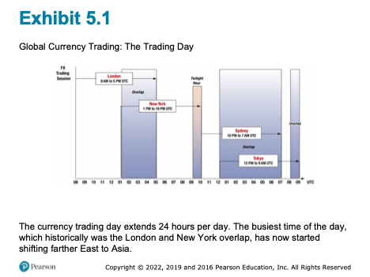
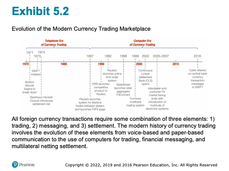
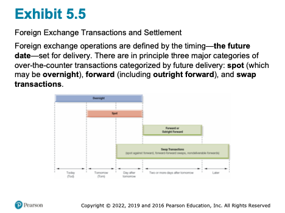
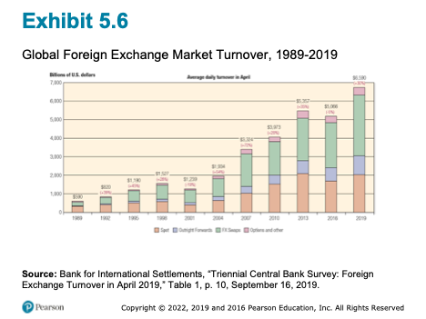
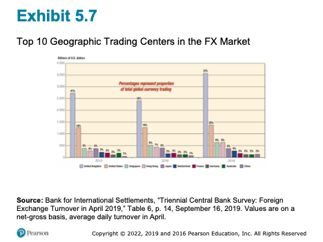
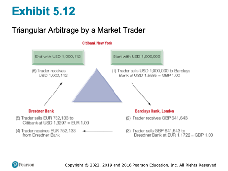
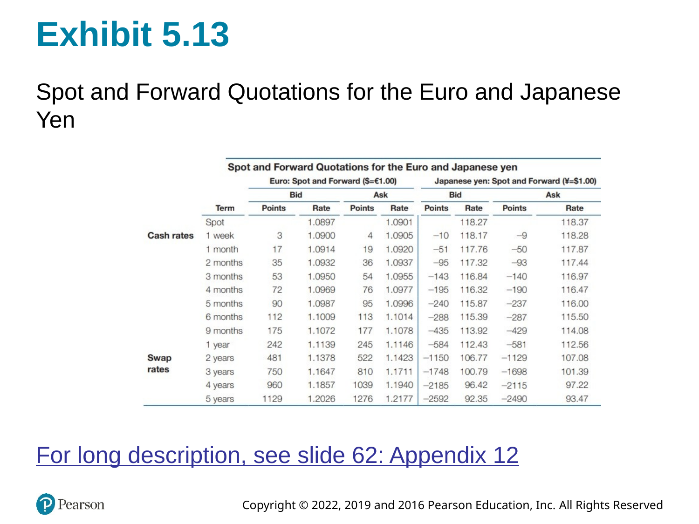

# Introduction

Random Quote: **"The old world is dying, and the new world struggles to be born: Now is the time of monsters." - Antonio Gramsci**

Another Random Quote: **"Fairy tales do not tell children that dragons exist. Children already know this. Fairy tales tell children that dragons can be killed." - G.K. Chesterton**

Scripture: **"You will hear of wars and rumors of wars, but see that you are not alarmed. Such things must happen, but the end is still to come." Matthew 24:6**

And: **"I have told you these things, so that in me you may have peace. In this world you will have trouble. But take heart! I have overcome the world." John 16:33**

> "The best way to destroy the capitalist system is to debauch the currency. By a continuing process of inflation, governments can confiscate, secretly and unobserved, an important part of the wealth of their citizens."
>
> — John Maynard Keynes

This chapter is your *operating manual* for how currencies are actually exchanged in real markets: who trades, why they trade, how trades are quoted and settled, and what kinds of transactions dominate volume.  

The conceptual points of the chapter (FX is just Foreign Exchange):

1.  **FX exists to move purchasing power across borders.** That’s the *economic* reason the market exists.
2.  **FX is also a market microstructure.** Institutions, technology, and market conventions determine *how* prices are formed and trades are executed.
3.  **FX quotes are a language.** If you can read that language fluently (direct/indirect, European/American, bid/ask, forwards in points), you can translate any transaction into a cash flow and a risk exposure.

## Chapter Roadmap {.unnumbered}

Major sections:

1.  **Functions of the FX market** — what the market *does*.
2.  **Structure and participants** — who trades and how the market has evolved.
3.  **Transactions** — spot, forwards, swaps (and NDFs), plus why swaps dominate volume.
4.  **Rates and quotations** — how to read quotes, compute cross-rates, and spot arbitrage.
5.  **Summary** — a compact “mental model” you can keep.

------------------------------------------------------------------------

## Learning Objectives {.unnumbered}

After this lecture, you should be able to:

-   Explain the three classic functions of the FX market (purchasing power transfer, trade credit, risk hedging).
-   Describe the modern market structure (electronic trading, reduced interdealer/customer separation, prime brokerage, retail aggregation).
-   Distinguish spot, forward, and swap transactions and explain why swaps dominate market turnover.
-   Read currency quotations in multiple conventions (ISO codes, base/quote, European vs. American terms, direct vs. indirect) and interpret bid/ask spreads.
-   Compute cross rates and identify when triangular (intermarket) arbitrage may exist.
-   Interpret forward points/pips and translate them into forward premiums/discounts.

------------------------------------------------------------------------

## Functions of the Foreign Exchange Market

### The three functions (and why they matter)

The foreign exchange (FX) market is the mechanism by which participants:

1.  **Transfer purchasing power between countries.**  
    When a U.S. firm buys from a Japanese supplier, *someone* must end up holding yen and *someone* must end up holding fewer dollars. The FX market is how we convert one money into another so the transaction can clear.

2.  **Obtain or provide credit for international trade transactions.**  
    Goods move slowly relative to money. Inventory in transit has to be financed (letters of credit, bankers’ acceptances, etc.). FX markets sit next to (and often inside) the trade finance machinery.

3.  **Hedge and transfer exchange-rate risk.**  
    Anytime you have a future cash flow in a foreign currency, you have a price risk: the home-currency value of that foreign cash flow can change before you receive/pay it. FX markets provide instruments to *transfer* that risk to someone willing to bear it.

**Note:** international trade forces you to choose *one* invoice currency; that choice allocates FX risk between the parties. The FX market is what allows either side to manage (or speculate on) that risk.

### Common misconceptions

-   **“The FX market is a physical place.”**  
    It’s overwhelmingly an electronic, global, Over the Counter (OTC) network (in other words, customizable, and not a central exchange).
-   **“FX is only for speculators.”**  
    The core volume exists because of trade, investment, and financing needs; speculation is *layered on top*.
-   **“Hedging eliminates risk for free.”**  
    Hedging transfers risk and typically locks in a price; it can reduce variance but it also removes the upside.

------------------------------------------------------------------------

## Structure of the Foreign Exchange Market

### The global trading day

FX is a **24-hour market** because major trading centers open and close sequentially.

**You can see this better in the slides or text.**

  {width="80%"}

**Observation:** liquidity is not uniform through the day. The market is usually deepest when major centers overlap (historically London–New York; increasingly Asia’s role has grown).

### Market participants – the players

A simple and useful classification is:

-   **Liquidity seekers**: participants who need FX to do something else (trade, investment, tourism, corporate treasury).
-   **Profit seekers**: participants who trade FX *as the business* (dealers, some hedge funds, arbitrageurs/speculators).

#### Bank and nonbank dealers

Dealers act as **market makers**:

-   They quote **bid** (what they will pay to buy) and **ask** (what they will charge to sell).
-   Their profit is primarily the **bid–ask spread**, adjusted for inventory risk and volatility.

**Microstructure logic:** a dealer is always managing two risks:

1.  **Inventory risk** (holding an open position while prices move)

2.  **Adverse selection risk** (the counterparty may know more than you)

#### Commercial and investment transactors

Importers/exporters, multinational corporations, portfolio investors, tourists.

-   FX is *incidental*—it is necessary to execute a commercial or investment transaction, but not the purpose.

#### Speculators and arbitrageurs

-   **Speculators** take positions to profit from expected exchange-rate changes. (Significantly more risk.)
-   **Arbitrageurs** exploit price inconsistencies across markets (simultaneous buy/sell to lock in profit).

A clean distinction:

-   Speculation: profit from **directional movement**.
-   Arbitrage: profit from **relative mispricing** with (near) no net exposure.

#### Central banks and treasuries

Central banks and treasuries enter FX markets to:

-   Manage **foreign exchange reserves**
-   Conduct **foreign exchange intervention** (influence the value of their currency through supply and demand)

**Critical difference:** they are not primarily profit motivated and may act as *willing loss takers* if it serves national objectives.

#### Foreign exchange brokers

Brokers match counterparties:

-   They facilitate trades **without becoming principals** in the transaction.
-   They earn commissions/fees rather than spreads.

### Evolution of the market

The collapse of Bretton Woods and the move toward floating rates expanded the market dramatically. Trading evolved by improving three components:

1.  **Trading** (how orders are executed)
2.  **Messaging** (how instructions are communicated)
3.  **Settlement** (how currencies are actually delivered)

{width="80%"}

### The evolution of FX trading

#### 1985: the telephone era

-   Voice-based trading.
-   Limited transparency; dealers had less information about “the market” at any moment.
-   Higher operational error risk (paper-based confirmations).

#### 1990s: computers + better information

-   Electronic messaging improves speed and reduces errors.
-   Dealers still “knew” who they were trading with, but market data improved.

#### 2010 – today: electronic dominance and tiering breakdown

Key developments:

-   **Multi-bank trading systems (MBT)** and **single-bank trading systems (SBT)**
-   **Prime brokerage** enables smaller players to access liquidity
-   **Retail aggregators** connect small customers into larger pools

**Conceptual payoff:** technology compresses spreads and increases access—but it can also change the form (not the existence) of market manipulation.

### The three components of FX trades

Every FX trade has three separable pieces:

1.  **The trade agreement** (price, amount, value date)
2.  **Payment/settlement instructions** (messaging)
3.  **Final settlement** (actual delivery of currencies)

This separation matters because *operational and settlement risk* can exist even when the price risk is hedged.

### FX market manipulation: “Fixing the fix”

Benchmark rates (like a daily “fix”) can be important for valuation and index tracking. Allegations (and enforcement actions) around 2013–2014 highlighted how:

-   Concentrated trading windows can create incentives to influence a benchmark.
-   Electronic trading reduces some manipulation channels but can enable new ones.

### The FX Global Code of Conduct (2016)

Following misconduct revelations, global principles emphasized:

-   Ethics
-   Governance
-   Information sharing
-   Execution
-   Risk management and compliance
-   Confirmation and settlement processes

------------------------------------------------------------------------

## Transactions in the Foreign Exchange Market

The FX market is commonly described by three transaction categories:

1.  **Spot**
2.  **Forward**
3.  **Swap** (including variations like NDFs)

### Spot transactions

A **spot transaction** is an agreement to exchange currencies with delivery typically on **T+2** (two business days after the trade date, for most major currency pairs).

Use-cases:

-   An exporter receives foreign currency today and wants home currency.
-   An importer needs foreign currency immediately to make payment.

### Forward transactions

An **outright forward** is an agreement today to exchange currencies at a **specified rate** on a **future value date**.

Core idea: a forward rate converts an uncertain future spot price into a known price *today*.

-   **Hedging**: lock in the home-currency value of a foreign-currency cash flow.
-   **Speculation**: take a view on where spot will be at maturity.

**Language nuance:**  
“Buying euros forward” and “selling dollars forward” describe the same trade—just from opposite currency perspectives.

### Swap transactions

A **swap** is the simultaneous purchase and sale of a currency for two different value dates (same counterparty).

Swaps dominate turnover largely because they are used to:

-   Manage short-term liquidity and funding needs
-   Roll positions and hedge exposures efficiently
-   Transform maturities (e.g., borrowing/lending implicitly in a foreign currency)

#### Spot against forward

This is the classic structure: buy (or sell) spot and do the opposite forward.

Interpretation: it resembles **fully collateralized borrowing/lending** in FX form.

#### Forward-forward swaps

Both legs are forward (two future value dates). Used for term funding and hedging.

#### Nondeliverable forwards (NDFs)

An **NDF** is a forward contract that settles in a hard currency (often USD) **without delivering** the restricted currency.

Typical when:

-   The currency has capital controls or limited convertibility.
-   Market participants still need hedging or price discovery offshore.

**Note:** NDFs are an institutional workaround—“we’ll settle the P&L in dollars rather than deliver the restricted currency.”

### Settlement timing and value dates

{width="90%"}

Vocabulary:

-   **Value date**: the settlement date when currency is delivered.
-   **Overnight**: extremely short-dated trades (often to manage liquidity).

### Size of the FX market

The FX market is the world’s largest financial market by turnover.

{width="90%"}

**Conceptual takeaway:** if swaps are the largest category, the FX market is not “mostly about tourists” or “mostly about importing/exporting goods.” It’s deeply tied to global financing.

### Geographical distribution

{width="90%"}

**Note:** London’s role as a global hub reflects time zone overlap, institutional depth, and historical network effects.

### Currency composition

The U.S. dollar appears on one side of most trades. That does **not** mean the U.S. must be a counterparty—it means the dollar is often the *vehicle currency* used to move between two less-liquid currencies.

### Common misconceptions

-   **“Spot means instantaneous.”**  
    In interbank markets it typically settles T+2 ("by day after tomorrow").
-   **“Forward contracts are like futures.”**  
    Both are forward-looking, but forwards are OTC and customized; futures are standardized and exchange-traded.
-   **“Swaps are rare/advanced.”**  
    They are the *largest* volume category because funding and liquidity management is constant.

------------------------------------------------------------------------

## Foreign Exchange Rates and Quotations

### Currency symbols and ISO codes

Currencies may be referenced by:

-   ISO codes (USD, GBP, JPY, EUR) are standard for electronic trading.
-   **ISO 4217** three-letter codes (USD, EUR, JPY, GBP, etc.)

In institutional electronic trading, ISO codes dominate.

### Exchange rate quotes: base and quote currency

Every quote is written as:

$$
\text{CUR}_1/\text{CUR}_2
$$

-   **Base (unit) currency**: CUR\_1 (the “1 unit” currency)
-   **Quote (price) currency**: CUR\_2 (how many units you pay to get 1 unit of base)

Example: **EUR/USD 1.2174** means 1 euro costs 1.2174 dollars.

### Market conventions

Different conventions can describe the same economic price.

#### European terms

“Foreign currency per 1 USD” (USD is the base).  
Example: USD/JPY 130.00 means USD 1 = JPY 130.

#### American terms

“USD per 1 unit of foreign currency” (USD is the quote).  
Example: EUR/USD 1.10 means EUR 1 = USD 1.10.

#### Currency nicknames

You will see informal terms in markets and news (e.g., “cable” for GBP/USD, “kiwi” for NZD). The key is to translate the nickname back to a base/quote pair.

#### Direct and indirect quotations

These depend on who is “home”:

-   **Direct quote**: home currency price of 1 unit of foreign currency.
-   **Indirect quote**: foreign currency price of 1 unit of home currency.

For a U.S. resident, $\text{USD}/\text{EUR}$ is direct; 
$\text{EUR}/\text{USD}$ is indirect.

#### Bid and ask rates

Interbank quotes are two-sided:

-   **Bid**: dealer buys the base currency (you sell it to the dealer)
-   **Ask (offer)**: dealer sells the base currency (you buy it from the dealer)

A useful operational rule:

-   *You buy at the ask; you sell at the bid.*

**Why do spreads exist?** processing costs, inventory costs, volatility, and market competition/liquidity.

### Cross rates

Many currency pairs are thinly traded. Their rate is often implied via a third currency (commonly USD).

Example logic:

If you know $\text{USD}/\text{EUR}$ and $\text{USD}/\text{GBP}$, then

$$
\text{EUR} / \text{GBP} = \frac{\text{USD}/\text{GBP}}{\text{USD}/\text{EUR}}
$$

(Keep track of units like you would in dimensional analysis.)

### Intermarket (triangular) arbitrage

Arbitrage exists when the implied cross-rate differs from the quoted cross-rate enough to overcome transaction costs.

{width="90%"}

An example of Arbitrage:

1.  Start with one currency (e.g., USD).
2.  Convert to a second currency at the dealer’s bid/ask.
3.  Convert to a third currency.
4.  Convert back to the original.
5.  If you end with more than you started (after costs), an arbitrage exists.

### Forward quotations

Forward rates are often quoted as **forward points** (or pips) relative to spot.

-   Spot is quoted “outright” (all digits).
-   Forwards are quoted as the *adjustment* to spot.

{width="90%"}

#### Forward premium/discount (annualized)

A common calculation uses mid-rates:

$$
\text{Forward premium (annualized)} \approx
\left(\frac{F - S}{S}\right) \times \frac{360}{n}
$$

-   If \(F > S\): the foreign currency is at a **forward premium** (in American terms).
-   If \(F < S\): it is at a **forward discount**.

**Important note:** the sign and interpretation can flip depending on quote convention (American vs European terms). The safest approach is to define your quote clearly, compute \((F-S)/S\), and interpret the meaning in words (“more or fewer USD per 1 unit of foreign currency”).

### Possible misconceptions

-   **“Direct vs. indirect is the same as American vs. European.”**  
    They are related but not identical; direct/indirect depends on who is “home.”
-   **“Bid/ask doesn’t matter in calculations.”**  
    It matters *a lot* for arbitrage and any realistic conversion path.
-   **“Cross rates are just multiplying numbers.”**  
    Cross rates are unit algebra; always track currency units.

------------------------------------------------------------------------

## Summary

A compact way to remember Chapter 5:

-   **Purpose:** FX moves purchasing power, provides trade finance mechanisms, and enables risk transfer.
-   **Structure:** a global OTC network with dealers as market makers; technology has widened access and changed microstructure.
-   **Transactions:** spot (near-term delivery), forwards (future delivery at fixed rate), swaps (two legs; dominant volume), and NDFs (offshore settlement in hard currency).
-   **Language:** quotes have conventions—base/quote, direct/indirect, European/American terms, bid/ask.
-   **Computation:** cross rates and arbitrage are unit-consistent bookkeeping; forward points translate spot into forward.

If you leave with one skill, make it this: **given any FX quote, you can state (i) what is being priced, (ii) what you pay to buy and what you receive to sell, and (iii) how that quote maps into a real cash flow and risk exposure.**