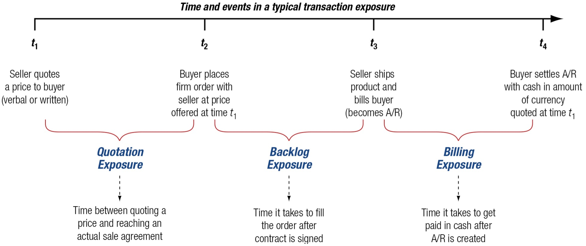

# Introduction

Random Quote (One of the most comforting things I have heard): **"When God put a calling on my life, He already factored in my stupidity."**

Bible Quote: **"The plans of the diligent lead surely to abundance,  
&nbsp;&nbsp;&nbsp;&nbsp;&nbsp;&nbsp;but everyone who is hasty comes only to poverty."** **-Proverbs 21:5**

Textbook Quote: **"There are two times in a man's life when he should not speculate: when he can't afford it and when he can."** 

- "Following the Equator, Pudd'nhead Wilson's New Calendar," Mark Twain

**From the first paragraph of the chapter:** "Foreign exchange exposure is a measure of the potential for a firm's profitability, net cash flow, and market value to change because of a change in exchange rates. An important task of the financial manager is to measure foreign exchange exposure and to manage it so as to maximize the profitability, net cash flow, and market value of the firm."

**Central Problem of the chapter:** once exchange rates move, how does that movement affect the firm's actual contracts, cash flows, reported income, and treasury decisions? 

This chapter focuses on **transaction exposure**, the most immediate and visible form of foreign exchange exposure. It is immediate because it affects specific receivables, payables, loans, and contractual settlements. It is visible because the resulting gains and losses often appear directly in reported earnings. For that reason, transaction exposure is often the form of exposure that receives the most attention from treasury managers and chief financial officers.

The central logic of the chapter is straightforward:

- Firms face foreign exchange exposure because business contracts are often denominated in foreign currencies.
- Exchange-rate changes alter the domestic-currency value of those contractual cash flows.
- Treasury can either leave the exposure unhedged or manage it with forwards, money market positions, or options.
- The appropriate choice depends on the firm's risk tolerance, expected exchange-rate movements, costs of hedging, and managerial objectives.

## Chapter Roadmap {.unnumbered}

Major sections:

1. **Types of Foreign Exchange Exposure** - Distinguishes transaction, translation, and operating exposure.
2. **Why Hedge?** - Explains why firms do or do not hedge currency risk.
3. **Transaction Exposure** - Defines the exposure and shows how it arises from trade, borrowing, and contracts.
4. **Transaction Exposure Management** - Demonstrates the mechanics of unhedged, forward, money market, and options hedges.
5. **Transaction Exposure Management in Practice** - Examines how firms actually hedge, what they hedge, and which instruments they use most often.

------------------------------------------------------------------------

## Types of Foreign Exchange Exposure

A multinational firm does not face only one kind of currency risk. It faces **three distinct types of foreign exchange exposure**, and these exposures differ in both economic meaning and financial statement impact.

From our textbook:

### Transaction Exposure

- measures changes in the value of contractual obligations incurred between the time in which they are created and booked, and when they are settled due to a change in exchange rates.

Typical examples include:

- a foreign-currency **account receivable** from an export sale,
- a foreign-currency **account payable** for an import purchase,
- a foreign-currency **loan payable**, or
- a **forward contract** itself, once it is signed.

### Translation Exposure

- the potential for accounting-derived changes in owner's equity or consolidated income to occur because of the need to "translate" foreign currency to prepare worldwide consolidated financial statements.

Such as:

- **Transaction losses** are realized and typically affect taxable income in the year realized.
- **Translation losses** are accounting losses and are generally not cash losses; therefore, they are usually not tax deductible as realized operating losses.

### Operating Exposure

- also commonly called **economic** or **competitive** exposure, measures the changes in the present value of the firm resulting from any change in future operating cash flows of the firm caused by an unexpected change in exchange rates. The change in value depends on the effect of the exchange rate change on future sales volume, prices, and costs.

Examples include:

- a stronger home currency making exports less competitive,
- a weaker foreign rival's currency pressuring prices in third-country markets,
- imported inputs becoming cheaper after home-currency appreciation, or
- future foreign sales becoming more valuable in home-currency terms.

A useful summary is provided below:

| Exposure Type | Core Idea | Time Horizon | Financial Statement Effects|
|---|---|---|---|---|
| **Transaction exposure** | Change in value of existing foreign-currency contractual cash flows | Short- to medium-term | Cash Flows and Profitability |
| **Translation exposure** | Change in reported consolidated statements when foreign subsidiaries are translated into parent currency | Accounting period by accounting period | Income and Equity, but not Cash Flows |
| **Operating exposure** | Change in the present value of future operating cash flows caused by unexpected exchange-rate changes | Medium- to long-term | Possibly everything, but not in the current period |

## Why Hedge?

"Multinational firms consist of a multitude of cash flows that are sensitive to changes in exchange rates, interest rates, and commodity prices. These outstanding obligations and contracts are altered by changes in exchange rates.

### Hedging Defined

A **hedge** can help to manage this risk. Hedging requires a firm to take a position—an asset, contract, or derivative—the value of which will rise or fall in a manner that counter the fall or rise in value of an existing position - the exposure. Hedging protects against the possible loss, but also eliminates any gain from an increase in value as well. So what is gained from hedging?

According to finance theory, the value of the firm is the present value of all expected future cash flows.

Hedging does not normally increase the expected cash flow itself. Instead, it reduces the **variance** around that expectation. 

A useful conceptual picture is this:

- **Unhedged firm:** wider distribution of possible cash flows.
- **Hedged firm:** narrower distribution around the mean.

That narrower distribution means **less risk**. It does **not automatically mean higher expected value**.

Graphically, the distribution of possible cash flows becomes narrower (think of a normal distribution, and then a second distribution more tightly centered around the mean).

Hedging reduces the variability of expected cash flows about the mean of the distribution. This reduction in distribution variance is a reduction of risk.

**Important point** Hedging does not increase or decrease profitability by itself, it is only reducing the risk. If the normal distribution moved to the right, then the hedge would be increasing the profitability of the firm (or vice versa).

### The Pros and Cons of Hedging

There is substantial debate in finance over whether firms should hedge currency risk. This is not a trivial disagreement. It reflects different views about market efficiency, managerial incentives, financial distress, and shareholder diversification.

### Pros

**1. Hedging improves planning.**  
If future cash flows are more predictable, management can budget, invest, and finance the firm more confidently. A reduction in uncertainty may make otherwise desirable projects feasible.

**2. Hedging reduces the probability of financial distress.**  
If exchange-rate movements can push cash flows below a critical minimum needed for debt service or operations, hedging lowers the chance that the firm crosses that dangerous threshold.

**3. Management may understand the firm's actual currency exposures better than outside shareholders.**  
Managers know invoice currency, supplier practices, pricing terms, and internal exposures in a way investors generally do not.

**4. Management may identify disequilibrium conditions.**  
If markets are not always in perfect equilibrium, management may selectively hedge when conditions are especially favorable or dangerous.

### Cons

**1. Shareholders can diversify on their own.**  
Investors may prefer to manage currency risk through portfolio diversification rather than have the corporation do it for them.

**2. Hedging does not increase expected cash flows.**  
A hedge typically reduces variance, not expected value. Since hedging often has explicit or implicit cost, it may even reduce expected net cash flow.

**3. Agency problems may distort hedging decisions.**  
Managers are often more risk-averse than shareholders. They may hedge to protect their own careers or accounting outcomes rather than to maximize shareholder value.

**4. Managers cannot systematically outguess the market.**  
If parity conditions and market efficiency broadly hold, the expected net present value of hedging should be near zero before costs.

**5. Hedging may be motivated by optics rather than value.**  
Foreign exchange losses show up visibly in financial statements. Hedging costs may be buried elsewhere. This can bias managerial decision-making.

**6. Efficient market theorists believe that investors see through the "accounting veil."** Therefore, they understand what management is doing and only see hedging as an added cost of doing business.

A hedge adds value only if the benefits of lower volatility, lower distress cost, better planning, or better market access are large enough to exceed the cost of the hedge. Hedging does not add return.

## Transaction Exposure

Transaction exposure measures gains or losses that arise from the settlement of existing financial obligations whose terms are stated in a foreign currency. In plain language, the contract already exists, but the exchange rate at settlement is still unknown.

This exposure arises most often from three classes of activity:

1. **Purchasing or selling goods or services** in foreign currency,
2. **Borrowing or lending funds** in foreign currency, and
3. **Entering other foreign-currency-denominated obligations**, including some derivative contracts.

### Purchasing and Selling

The most common source of transaction exposure is trade.

Suppose a U.S. exporter sells merchandise to a Belgian buyer for **EUR 1,800,000**, payable in 60 days. On the date of sale, the spot rate is:

$$
\text{USD }1.1200 = \text{EUR }1.00
$$

So the receivable is booked at:

$$
\text{EUR }1,800,000 \times \text{USD }1.1200 = \text{USD }2,016,000
$$

That booked amount is not the final dollar amount actually received. If, by the settlement date, the euro weakens to:

$$
\text{USD }1.1000 = \text{EUR }1.00
$$

then the actual dollars received become:

$$
\text{EUR }1,800,000 \times \text{USD }1.1000 = \text{USD }1,980,000
$$

So the foreign exchange gain or loss is:

$$
\text{FX gain (loss)} = \text{USD }1,980,000 - \text{USD }2,016,000 = -\text{USD }36,000
$$

If instead the euro strengthens to:

$$
\text{USD }1.3000 = \text{EUR }1.00
$$

then settlement becomes:

$$
\text{EUR }1,800,000 \times \text{USD }1.3000 = \text{USD }2,340,000
$$

and the exporter realizes a gain of:

$$
\text{USD }2,340,000 - \text{USD }2,016,000 = \text{USD }324,000
$$

So a foreign-currency receivable contains both downside risk and upside potential.

#### **The life span of transaction exposure**

{width="100%"}

Some firms do not formally treat quotation exposure or backlog exposure as hedgeable transaction exposure because the contract may still change or be cancelled. Other firms, especially those with predictable business patterns, do hedge some of these earlier stages.

### Borrowing and Lending

A second source of transaction exposure arises when firms borrow or lend in foreign currency.

The chapter uses the example of **Gemex**, PepsiCo's large Mexican bottler in the mid-1990s. Gemex had U.S. dollar debt of **USD 264 million**. When the Mexican peso was around:

$$
\text{MXN }3.45 = \text{USD }1.00
$$

the peso value of that debt was:

$$
\text{USD }264,000,000 \times \text{MXN }3.45 = \text{MXN }910,800,000
$$

After the peso weakened sharply to about:

$$
\text{MXN }5.50 = \text{USD }1.00
$$

the peso value of the same dollar debt became:

$$
\text{USD }264,000,000 \times \text{MXN }5.50 = \text{MXN }1,452,000,000
$$

So the peso burden of the debt increased by:

$$
\text{MXN }1,452,000,000 - \text{MXN }910,800,000 = \text{MXN }541,200,000
$$

This illustrates a critical point: even when the debt amount in foreign currency is fixed, the **home-currency burden** can change dramatically.

For a borrower with domestic-currency cash flows, this can create severe financial stress.

### Other Causes of Transaction Exposure

Transaction exposure also arises from **forward exchange contracts** and other contractual positions entered into to hedge or finance the firm.

For example, suppose a U.S. importer owes **JPY 100 million** in 90 days for an import purchase. It may hedge that payable by buying **JPY 100 million forward** today for delivery in 90 days. That forward contract itself is now a contractual obligation. Even though it was created as a hedge, it is also a transaction exposure because the firm is committed to settle the contract.

This is conceptually important: a hedge is still a contract. If the underlying commercial exposure disappears **(a cancelled order)**, the hedge may remain and become its own problem unless it is offset, reversed, or restructured.

## Transaction Exposure Management

Once a transaction exposure exists, management must decide how to respond. The broad menu includes:

- leaving the exposure **unhedged**,
- using a **forward hedge**,
- using a **money market hedge** (also called a **balance sheet hedge**),
- using an **options market hedge**, or
- using operating policies such as natural hedges, risk-sharing, or timing adjustments.

This chapter emphasizes the **contractual or financial hedges**. These are the techniques most frequently used for clearly identifiable short-term exposures.

### Ganado’s Transaction Exposure

The textbook's central example is **Ganado**, a U.S. firm that sells a turbine generator to a British company, Regency, for:

$$
\text{GBP }1,000,000
$$

with payment due in 90 days.

The key market data are:

| Item | Value |
|---|---:|
| Spot rate | $$ \text{USD }1.7640 = \text{GBP }1.00 $$ |
| 90-day forward rate | $$ \text{USD }1.7540 = \text{GBP }1.00 $$ |
| Expected future spot | $$ \text{USD }1.7600 = \text{GBP }1.00 $$ |
| U.S. 90-day borrowing rate | 2.00% |
| U.S. 90-day investment rate | 1.50% |
| U.K. 90-day investment rate | 2.00% |
| U.K. 90-day borrowing rate | 2.50% |
| Ganado WACC for 90 days | 3.00% |
| 90-day put option strike | $$ \text{USD }1.75 = \text{GBP }1.00 $$ |
| Put premium | 1.5% |

The sale was booked at:

$$
\text{GBP }1,000,000 \times \text{USD }1.7640 = \text{USD }1,764,000
$$

Ganado's **budget rate**—the lowest acceptable dollar value consistent with minimum profitability—is:

$$
\text{USD }1.70 = \text{GBP }1.00
$$

That budget rate matters because it means management is not merely choosing the mathematically best hedge; it is choosing a hedge consistent with the firm's minimum acceptable margin (below this rate, Ganado will not make a profit).

### Unhedged Position

The unhedged strategy is the simplest:

- do nothing today,
- receive pounds in 90 days,
- convert them at the then-current spot rate.

If the expected spot rate occurs,

$$
\text{GBP }1,000,000 \times \text{USD }1.7600 = \text{USD }1,760,000
$$

But if the pound falls to, say,

$$
\text{USD }1.65 = \text{GBP }1.00
$$

Ganado would receive only:

$$
\text{GBP }1,000,000 \times \text{USD }1.65 = \text{USD }1,650,000
$$

That would fall **below** the budget rate threshold of USD 1.70 per GBP and could wipe out the deal's expected profit and create a probable loss of \$50,000.

The appeal of remaining unhedged is upside participation. Had the US currency weakened, there would have been a profit for Ganado that would not have been limited by a hedge.  The weakness is obvious: full downside exposure remains due to the lack of hedging.

### Forward Hedge

A **forward hedge** locks in a future exchange rate today.

Since Ganado will receive pounds in the future, it should **sell pounds forward** today at the 90-day forward rate:

$$
\text{GBP }1,000,000 \text{ forward at } \text{USD }1.7540 = \text{GBP }1.00
$$

In 90 days Ganado receives the pounds from its customer and delivers them into the forward contract, receiving:

$$
\text{GBP }1,000,000 \times \text{USD }1.7540 = \text{USD }1,754,000
$$

Compared with the booked value of USD 1,764,000, the accounting foreign exchange result is:

$$
\text{USD }1,754,000 - \text{USD }1,764,000 = -\text{USD }10,000
$$

So Ganado records a **foreign exchange loss of USD 10,000** (about 0.5% loss) relative to the booking date. But notice what it gains is certainty in the exchange.

A fully matched forward hedge is sometimes called:

- **covered**,
- **perfect**, or
- **square**.

That means the firm already has, or will receive, the exact foreign currency needed to fulfill the forward contract. No residual currency risk remains.

### Money Market Hedge (Balance Sheet Hedge)

A **money market hedge** uses borrowing and spot exchange rather than a forward contract. For a receivable, the firm:

1. **borrows the foreign currency today**,
2. **converts it into home currency at the spot rate**, and
3. **repays the foreign-currency loan when the receivable arrives**.

Ganado needs a GBP loan whose principal plus interest equals the future receivable of GBP 1,000,000. Since the U.K. 90-day borrowing rate is 2.5%, the amount borrowed today must be:

$$
\frac{\text{GBP }1,000,000}{1+0.025} = \text{GBP }975,610
$$

Ganado converts that immediately into dollars at the spot rate:

$$
\text{GBP }975,610 \times \text{USD }1.7640 = \text{USD }1,720,976
$$

In 90 days, the GBP receivable of GBP 1,000,000 is used to repay the GBP loan:

$$
\text{GBP }975,610 + \text{GBP }24,390 = \text{GBP }1,000,000
$$

So the money market hedge creates a pound liability that offsets the pound asset. That is why it is also called a **balance sheet hedge**.

A simple balance-sheet view looks like this:

| Assets | Liabilities and Net Worth |
|---|---|
| Account receivable: $$ \text{GBP }1,000,000 $$ | GBP loan principal: $$ \text{GBP }975,610 $$ |
|  | Interest payable: $$ \text{GBP }24,390 $$ |
| **Total**: $$ \text{GBP }1,000,000 $$ | **Total**: $$ \text{GBP }1,000,000 $$ |

### Forward and Money Market Hedges Compared

The forward hedge produces dollars in 90 days. The money market hedge produces dollars **today**. So to compare them fairly, the money market hedge proceeds must be carried forward.

Using Ganado's WACC of 3.0% for the 90-day period,

$$
\text{USD }1,720,976 \times 1.03 = \text{USD }1,772,605
$$

This is the future value of the money market hedge proceeds.

Now compare:

| Hedge Method | Future Value in 90 Days |
|---|---:|
| Forward hedge | $$ \text{USD }1,754,000 $$ |
| Money market hedge | $$ \text{USD }1,772,605 $$ |

Under the assumptions in the chapter, the money market hedge is superior.

#### Break-even reinvestment rate

The text also calculates the break-even investment rate that would make the two methods equivalent.

Set:

$$
\text{Loan proceeds} \times (1+r) = \text{Forward proceeds}
$$

So,

$$
\text{USD }1,720,976 \times (1+r) = \text{USD }1,754,000
$$

which gives:

$$
r = 0.0192
$$

Annualizing over a 360-day year:

$$
0.0192 \times \frac{360}{90} \times 100 = 7.68\%
$$

Interpretation:

- If Ganado can earn **more than 7.68% annualized** on the money market hedge proceeds, the money market hedge dominates.
- If it can earn **less than 7.68%**, the forward hedge is preferable.

This is an excellent finance insight because it shows that the relative attractiveness of the money market hedge depends on what the firm can do with the dollars received today.

### Options Market Hedge

An **options hedge** gives the firm protection against unfavorable exchange-rate movements while still allowing participation in favorable movements.

Because Ganado has a GBP receivable, it wants a **put option on GBP**. It can buy a 90-day put on **GBP 1,000,000** with strike price:

$$
\text{USD }1.75 = \text{GBP }1.00
$$

and premium of **1.5%**.

The option premium cost today is:

$$
\text{GBP }1,000,000 \times 0.015 \times \text{USD }1.7640 = \text{USD }26,460
$$

Carrying that cost forward 90 days at the WACC of 3%:

$$
\text{USD }26,460 \times 1.03 = \text{USD }27,254
$$

So the future value cost of the option is USD 27,254.

#### If the pound is above the strike at maturity

Suppose the expected spot occurs:

$$
\text{USD }1.7600 = \text{GBP }1.00
$$

Ganado lets the put expire and sells pounds in the spot market:

$$
\text{GBP }1,000,000 \times \text{USD }1.7600 = \text{USD }1,760,000
$$

Net of option cost:

$$
\text{USD }1,760,000 - \text{USD }27,254 = \text{USD }1,732,746
$$

#### If the pound falls below the strike

If the pound falls below USD 1.75, Ganado exercises the put and receives:

$$
\text{GBP }1,000,000 \times \text{USD }1.75 = \text{USD }1,750,000
$$

Net of option cost:

$$
\text{USD }1,750,000 - \text{USD }27,254 = \text{USD }1,722,746
$$

So the option hedge sets a **floor** on net proceeds of:

$$
\text{USD }1,722,746
$$

That floor is lower than the certainty offered by the forward or money market hedge in this example, but the option preserves upside beyond the strike.

### Hedging Alternatives Compared

Ganado's main alternatives for the GBP receivable can be summarized as follows.

| Alternative | Outcome |
|---|---|
| **Remain unhedged** | Best upside, worst downside; fully exposed to spot-rate movements |
| **Forward hedge** | Locks in $$ \text{USD }1,754,000 $$ |
| **Money market hedge** | Creates future value of $$ \text{USD }1,772,605 $$ under textbook assumptions |
| **Put option hedge** | Minimum of $$ \text{USD }1,722,746 $$, but retains upside above strike less option cost |

The chapter's graphical comparison makes two ideas especially clear:

1. If management expects the exchange rate to move **against** the firm, the money market hedge is strongest in this example.
2. If management expects the exchange rate to move **in favor** of the firm, the option may be attractive because it protects the downside while preserving upside.

The choice is therefore not mechanical. It depends on two decision criteria that appear repeatedly in this chapter and in the test bank:

1. **The firm's risk tolerance**, and
2. **Management's exchange-rate expectation and confidence in that view.**

### Hedging an Account Payable

The logic for a payable is similar, but the mechanics reverse.

If Ganado had to **pay** GBP 1,000,000 in 90 days instead of receiving it, then a stronger pound would be bad news because it would raise the dollar cost of the payment.

The major alternatives are again:

- remain unhedged,
- buy GBP forward,
- use a money market hedge, or
- buy a call option on GBP.

#### Remain Unhedged

If Ganado remains unhedged, it waits 90 days and buys pounds in the spot market when the payment is due.

If the expected spot is:

$$
\text{USD }1.7600 = \text{GBP }1.00
$$

then the expected dollar cost is:

$$
\text{GBP }1,000,000 \times \text{USD }1.7600 = \text{USD }1,760,000
$$

But that cost is uncertain. If the pound rises further, the cost rises. If the pound falls, the cost falls.

#### Forward Market Hedge

To hedge a GBP payable, Ganado must **buy GBP forward**.

At the 90-day forward rate:

$$
\text{USD }1.7540 = \text{GBP }1.00
$$

the certain dollar cost becomes:

$$
\text{GBP }1,000,000 \times \text{USD }1.7540 = \text{USD }1,754,000
$$

This is certain and, in the chapter's example, lower than the expected unhedged cost based on the forecast spot rate.

#### Money Market Hedge

For a payable, the money market hedge reverses direction from the receivable case. Ganado must:

1. buy pounds spot today,
2. invest them for 90 days in a GBP account, and
3. use the future pound balance to settle the payable.

The pounds needed today are the present value of GBP 1,000,000 discounted at the U.K. 90-day investment rate of 2%:

$$
\frac{\text{GBP }1,000,000}{1.02} = \text{GBP }980,392.16
$$

At the spot rate of USD 1.7640 = GBP 1.00, this requires current dollars of:

$$
\text{GBP }980,392.16 \times \text{USD }1.7640 = \text{USD }1,729,411.77
$$

To compare this fairly to other methods, carry the current dollar cost forward 90 days using the WACC of 3%:

$$
\text{USD }1,729,411.77 \times 1.03 = \text{USD }1,781,294.12
$$

So in this specific example, the money market hedge is more expensive than the forward hedge.

#### Option Hedge

For a payable, the correct option is a **call option on GBP**.

Ganado can buy a call on **GBP 1,000,000** with strike price:

$$
\text{USD }1.75 = \text{GBP }1.00
$$

The premium today is again:

$$
\text{GBP }1,000,000 \times 0.015 \times \text{USD }1.7640 = \text{USD }26,460
$$

Carried forward 90 days at 3%:

$$
\text{USD }26,460 \times 1.03 = \text{USD }27,254
$$

If the pound is above the strike at maturity, Ganado exercises the call and buys GBP at USD 1.75. Total maximum dollar cost becomes:

$$
\text{GBP }1,000,000 \times \text{USD }1.75 + \text{USD }27,254 = \text{USD }1,777,254
$$

So the call option places a ceiling on the total cost of the payable:

$$
\text{USD }1,777,254
$$

If the pound is below the strike at maturity, Ganado lets the call expire and buys GBP in the cheaper spot market, still having paid the premium.

#### Strategy Choice

For the account payable case, the chapter's numbers imply the following ranking under the stated forecast:

| Alternative | Dollar Cost |
|---|---:|
| Forward hedge | $$ \text{USD }1,754,000 $$ |
| Money market hedge | $$ \text{USD }1,781,294 $$ |
| Call option hedge | Maximum of $$ \text{USD }1,777,254 $$ |
| Unhedged | Uncertain |

Given an expected spot of USD 1.76 per pound, the **forward hedge** appears to be the preferred choice in the textbook example.

Again, the general logic is:

- For a **receivable**, a firm fears depreciation of the foreign currency and may use a **put** or **sell forward**.
- For a **payable**, a firm fears appreciation of the foreign currency and may use a **call** or **buy forward**.

## Transaction Exposure Management in Practice

The theory of hedging is tidy. Practice is not. Firms differ widely in what they hedge, how far out they hedge, how much they hedge, and which instruments they are willing to use.

A key line from the chapter is worth emphasizing: **there are as many different approaches to transaction exposure management as there are firms.**

### Which Goals

Most treasury departments are not structured as profit centers. They are normally viewed as **cost centers** or **service centers**. That means the treasury's job is not usually to make money by betting on exchange rates. Its job is to protect the firm's cash flows and support operations.

Common practical goals include:

- reducing exchange-rate-induced volatility in earnings,
- protecting budget rates and operating margins,
- increasing predictability of future cash flows,
- reducing the chance of financial distress,
- supporting debt servicing capacity, and
- smoothing reported results.

In public companies especially, **earnings smoothing** is often a major objective. Investors prefer more stable and predictable earnings, and firms often believe a sensible hedging program can reduce earnings volatility.

This point also explains why many firms hedge over a horizon linked to budgeting. If the budgeting process is quarterly or annual, treasury often thinks in those same windows.

### Which Transaction Exposures

In practice, firms increasingly hedge not only **existing on-balance-sheet exposures** but also some **anticipated exposures**.

Historically, many firms prohibited hedging anything not yet booked. The logic was conservative:

- an unbooked transaction may never occur,
- but a derivative contract certainly will exist once entered,
- so the hedge itself may become an unwanted speculative position if the forecasted transaction disappears.

Even so, many firms now hedge highly probable anticipated transactions, especially when they arise from:

1. **Contractual exposures** under ongoing commercial agreements, and
2. **Intra-firm transactions** between parent and subsidiary or between subsidiaries.

For example, if a company ships to a foreign customer every 90 days under a multi-year supply contract, future receivables are not yet booked, but their likelihood is high. Many firms treat those as hedgeable anticipated exposures.

The same is true for global supply chains. Intra-company shipments and transfer-pricing arrangements often generate regular, predictable cross-border flows. Those too may be hedged.

### What Levels of Exposure Cover

Many firms use **proportional hedging policies**. Instead of hedging everything or nothing, they hedge a specified percentage of exposures by currency and maturity.

A typical policy might look like this:

| Maturity Bucket | Typical Cover Policy |
|---|---|
| 0-30 days | Very high cover, perhaps 90% to 100% |
| 30-90 days | Moderate cover, perhaps 50% to 90% |
| More than 90 days | Selective cover or lower required percentage |

The logic is sensible:

- short-dated exposures are more certain and more easily measured, so firms hedge more of them;
- long-dated exposures are less certain, more likely to change, and more costly to hedge rigidly.

The chapter notes that as maturity lengthens, the required percentage of forward cover often **decreases**, not increases. This is a practical test-bank point.

A further implication is worth stating clearly: once firms hedge only part of an exposure and then decide selectively what to hedge beyond that, they are implicitly expressing a market view. That is one reason proportional hedging can shade into selective hedging and, at times, into speculation.

### Which Hedging Instruments and Structures

The Wells Fargo survey summarized in the chapter shows that actual corporate practice is heavily tilted toward **forward contracts**.

A simplified representation of the survey results is:

#### Hedging practices

| Practice | Approximate Share of Firms |
|---|---:|
| Hedge trade-related exposures | 70% |
| Hedge finance-related exposures | 67% |
| Hedge forecasted exposures | 59% |
| Hedge net equity investment in subsidiaries | 10% |
| Hedge net income of subsidiaries | 8% |

#### Hedging instruments

| Instrument | Approximate Share of Firms |
|---|---:|
| Forward contracts | 96% |
| Options and option combinations | 20% |
| Cross-currency swaps | 12% |
| Other | 5% |

These numbers are revealing.

**Forward contracts dominate practice.** Why?

- They are simple.
- They are familiar.
- They require no up-front premium.
- They provide certainty.
- They fit well with clearly identified receivables and payables.

**Options are used much less frequently.** The chapter gives three standard reasons:

1. **Cost** - premiums can be significant.
2. **Complexity** - many managers prefer simpler instruments.
3. **Bounded protection only** - options protect against one side of the distribution, but not always at the cheapest total cost.

This is especially important in classroom discussion. Students often assume options are always superior because they preserve upside. In reality, many firms view the premium as too expensive relative to the margin on the underlying sale.

The chapter also notes two practical forward-contract rules seen in many firms:

1. If a forward locks in a favorable accounting or settlement outcome, **100% cover** is often required.
2. If the forward premium or discount is small, firms are often willing to use a **high level of forward cover**.

So the practical conclusion is quite strong:

$$
\text{In real-world treasury practice, forwards remain the primary instrument for transaction exposure management.}
$$

------------------------------------------------------------------------

**Key Takeaways for Chapter 10**

- A firm faces **transaction**, **translation**, and **operating** exposure, but transaction exposure is the one most directly tied to already-contracted foreign-currency cash flows.
- Hedging generally **reduces risk**, not expected value.
- Transaction exposure commonly arises from **foreign-currency receivables, payables, loans, and derivative contracts**.
- The major contractual hedges are **forwards, money market hedges, and options**.
- For a **receivable**, the firm often sells the foreign currency forward or buys a **put**.
- For a **payable**, the firm often buys the foreign currency forward or buys a **call**.
- In practice, treasury decisions depend on **risk tolerance, expected exchange-rate movement, hedging cost, and corporate policy**.
- Real firms hedge unevenly, but **forward contracts dominate** practice.

