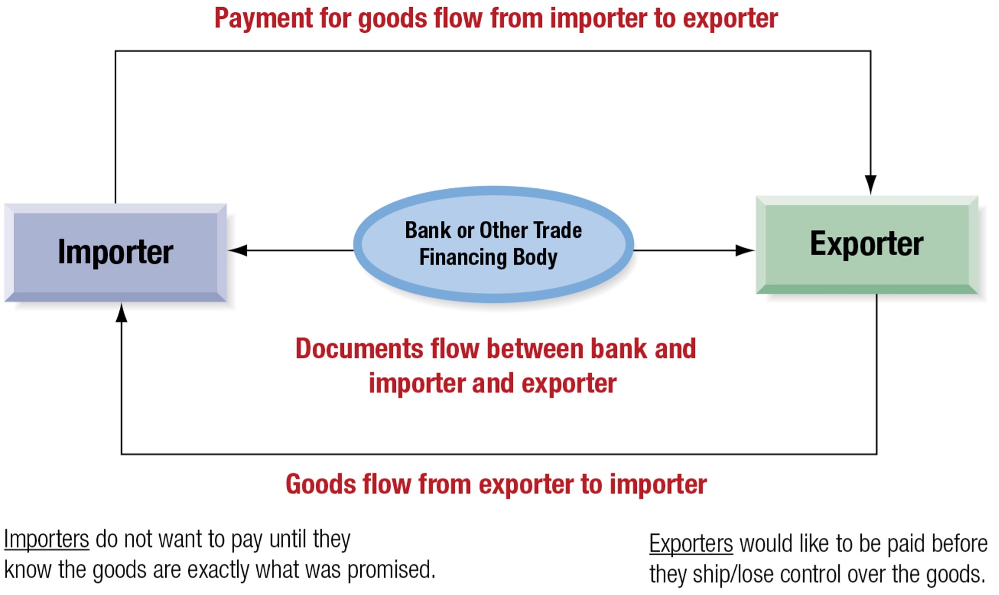
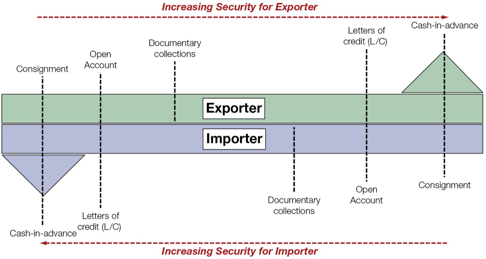
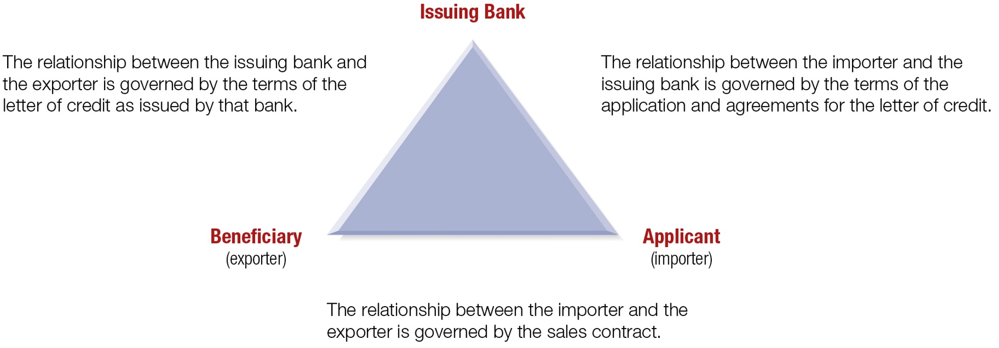
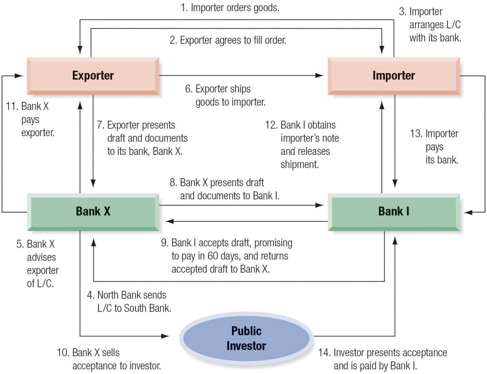

# International Trade Finance

Random Quote: **"It's hard to imagine a more stupid or more dangerous way of making decisions than by putting those decisions in the hands of people who pay no price for being wrong."** - Thomas Sowell

And Another: **It's better to be a restrained monster than a well-behaved coward."** - Jordan Peterson

Bible verse: **"In the same way, faith by itself, if it is not accompanied by action, is dead. But someone will say, "You have faith, I have deeds." Show me you faith without deeds, and I will show you my faith by my deeds. You believe that there is one God. Good! Even the demons believe that-and shudder."** = James 2:17-19

Textbook Quote: **"What the wise man does in the beginning, the fool does in the end."** - Nicccolo Machiavelli

This chapter examines the mechanics of financing international trade. At first glance, importing and exporting may appear to be simply an exchange of goods for money. In practice, however, international trade requires a carefully structured process because the exporter and importer are separated by distance, legal systems, time, and information. The exporter does not want to surrender control of the goods before payment is secure, while the importer does not want to release payment before receiving what was promised.

That tension is the center of international trade finance. The chapter therefore focuses on the trade relationship, the documentary system used to manage trade risk, the government institutions that support exports, the major financing alternatives for trade receivables, and the specialized medium- to long-term technique of forfaiting.

## Chapter Roadmap {.unnumbered}

Major sections:

1. **The Trade Relationship** - Why trade finance exists and why the exporter-importer relationship matters.
2. **Key Documents** - How the letter of credit, draft, and bill of lading work together.
3. **Government Programs to Help Finance Exports** - How states support exporters through insurance and credit programs.
4. **Trade Financing Alternatives** - The major short-term instruments used to finance trade receivables.
5. **Forfaiting** - A specialized non-recourse technique for medium- to long-term export financing.

------------------------------------------------------------------------

## The Trade Relationship

International trade finance begins with a basic business reality: firms must buy inputs, produce goods or services, and sell to customers under terms that protect profitability and cash flow. In domestic trade, the parties often operate under a common legal system and can verify one another more easily. In international trade, by contrast, geography, time, banking systems, currencies, and legal enforcement make the transaction more complicated.

A useful starting point is to distinguish among three different exporter-importer relationships:

1. **Affiliated parties** - The importer is another unit, subsidiary, parent, or related company within the same multinational enterprise.
2. **Unaffiliated known party** - The importer is unrelated to the exporter but has an established history of prior successful dealings.
3. **Unaffiliated unknown party** - The importer is unrelated and not previously known to the exporter.

This distinction matters because the amount of documentation, protection, and financing typically rises as familiarity and trust fall.

- With **affiliated parties**, trust and information are greatest. The transaction may require little formal protection against nonpayment, although standard trade documentation may still be used for financing, logistics, or political reasons.
- With an **unaffiliated known party**, a contract is still important, but the terms may be looser because the exporter has prior experience with the importer.
- With an **unaffiliated unknown party**, the exporter will usually require the most detailed contract and the strongest protection against nonpayment.

From a classroom perspective, this framework helps explain why not all trade transactions are documented the same way. The choice of trade finance method depends not only on the size of the sale, but also on the relationship between the parties.

### The Fundamental Dilemma

The fundamental dilemma of international trade is straightforward: **the exporter wants to be paid before giving up control of the goods, while the importer wants to pay only after receiving the goods promised.**

Because the two parties are separated by distance, trade cannot normally occur through a simultaneous hand-to-hand exchange. As a result, trade uses three coordinated flows:

1. **The flow of goods** from exporter to importer
2. **The flow of funds** from importer to exporter
3. **The flow of documents** among exporter, importer, and banks

The first two flows are the economic purpose of the transaction. The third flow is what makes the transaction workable. Documents are used to allocate rights, assign title, trigger payment, and provide assurance that both parties will perform.

A good way to summarize the dilemma is this:

- The exporter has already invested capital in producing or acquiring the goods.
- The importer does not want to release cash before having some confidence in delivery and conformity.
- A trusted financial intermediary, usually a bank, can stand between the two and reduce the need for direct trust.

That is why international trade finance is as much about **managing trust and timing** as it is about moving money.

{width="100%"}

### Payment Risk

Payment risk can be understood as a continuum between maximum security for the exporter and maximum security for the importer.

At the exporter's safest extreme is **cash-in-advance**. Under this arrangement, the importer pays before shipment. This is ideal for the exporter because the exporter bears very little payment risk. But it is unattractive to the importer, who must release funds without yet controlling the goods.

At the importer's safest extreme is **consignment**. Under consignment, the exporter may not be paid until the importer has actually sold the merchandise and generated cash. This arrangement is highly risky for the exporter.

Between these extremes lies a compromise zone that includes:

- **letters of credit**
- **documentary collections**
- **open account arrangements**

The central trade-finance question is therefore not simply whether the buyer will pay, but **how payment risk is allocated** between the two parties.

A useful summary is:

- **Exporter security increases** as the transaction moves from consignment toward cash-in-advance.
- **Importer security increases** as the transaction moves from cash-in-advance toward consignment.

Letters of credit and documentary collection procedures are important because they sit in the middle of this continuum and create a workable compromise between the two sides.

{width="100%"}

### Benefits of the Documentary System

The documentary system developed over centuries because it addresses three major problems in international trade:

1. **protection against risk of noncompletion**
2. **protection against foreign exchange risk**
3. **financing of goods in transit**

The three principal documents in this system are:

- the **letter of credit**
- the **draft**
- the **bill of lading**

These documents do not merely record the transaction. They structure the transaction.

#### Protection against Risk of Noncompletion

Risk of noncompletion is the risk that one of the parties fails to perform its side of the transaction.

For example:

- the exporter may ship goods and not be paid;
- the importer may pay and not receive the promised goods;
- external events such as political disruption, banking problems, or logistical breakdowns may prevent completion.

The documentary system reduces this risk by controlling **when** title passes, **when** payment is due, and **what documents** must be presented before banks act.

A letter of credit substitutes the credit standing of a bank for that of the importer. A bill of lading can be used to control title to the goods. A draft formally demands payment or acceptance. Together, these documents establish who bears loss if something goes wrong at a specific stage.

This is why the documentary system is especially valuable when the relationship is new, episodic, or located in a country where financial or political conditions are uncertain.

#### Protection against Foreign Exchange Risk

In international trade, foreign exchange risk arises from **transaction exposure**.

The exposed party depends on the currency of invoice and payment:

- If payment is required in the **exporter's currency**, the **importer** bears foreign exchange risk.
- If payment is required in the **importer's currency**, the **exporter** bears foreign exchange risk.

The documentary system does not itself hedge exchange risk. What it does is make the amount and timing of payment more definite. That matters because hedging techniques work best when the firm knows:

1. the amount of foreign currency involved, and
2. the approximate date on which payment will occur.

So the documents do not eliminate currency risk directly, but they help create the certainty needed for effective hedging.

#### Financing the Trade

International trade usually involves a lag between shipment and final settlement. During this period, funds are tied up while the merchandise is in production, shipment, customs handling, or local distribution.

Once the risks of noncompletion and exchange-rate uncertainty are sufficiently controlled, banks are generally willing to finance the goods in transit. This is one of the most practical contributions of the documentary system.

The bank is willing to lend not because it has inspected the goods physically, but because the documents establish a legally recognizable claim tied to the shipment.

That is an important conceptual point: **trade documentation converts a physical shipment into a financeable claim.**

### Noncompletion Risks

A useful way to understand noncompletion risk is through the sequence of a trade transaction:

1. price quote request
2. negotiations
3. export contract signed
4. backlog and preparation
5. goods shipped
6. documents presented
7. documents accepted
8. goods received
9. cash settlement

From a financial-management perspective, the **financing period** begins once the documents are presented and continues until cash settlement occurs. That is the period in which the exporter is most concerned about being paid and in which trade receivables become a financing problem.

The exporter wants to minimize this financing period because a longer financing period means:

- more capital tied up,
- more exposure to risk,
- and higher financing cost.

In a recurring relationship between strong counterparties, the exporter may eventually be willing to bill on **open account** after a standard credit check. But in a new or uncertain relationship, the exporter is more likely to insist on documentary protection, especially a letter of credit issued by a creditworthy bank.

------------------------------------------------------------------------

## Key Documents

The three key documents in international trade finance are:

1. **letter of credit (L/C)**
2. **draft (bill of exchange)**
3. **bill of lading (B/L)**

Together they form a coordinated system for allocating payment rights, transferring title, and financing trade receivables.

### Letter of Credit (L/C)

A **letter of credit (L/C)** is a document issued by a bank at the request of an importer by which the bank promises to pay an exporter upon presentation of documents specified in the L/C.

The key idea is that the bank pays **against documents**, not against an inspection of the actual goods. This sharply reduces risk for the exporter because the exporter no longer relies solely on the importing firm.

The letter of credit is not a guarantee of the underlying sales contract itself. It is a **separate transaction** governed by its own terms. That distinction is important. The bank's obligation is tied to documentary compliance, not to disputes over whether the merchandise was perfect, unless those issues are reflected in the documentary conditions.

To constitute a true L/C transaction, the issuing bank's commitment must have several basic features:

1. the bank receives a fee or other valid business consideration;
2. the L/C has a specified expiration date or maturity;
3. the L/C has a stated maximum amount;
4. the bank's obligation to pay arises only upon presentation of specified documents;
5. the importer must have an obligation to reimburse the bank once the bank has paid.

#### Parties to a Letter of Credit (L/C)

There are three principal parties:

1. **Applicant (importer)** - requests issuance of the L/C.
2. **Issuing bank** - promises payment if documentary conditions are met.
3. **Beneficiary (exporter)** - receives the benefit of the bank's promise to pay.

The relationships can be summarized as follows:

- The **importer-exporter** relationship is governed by the sales contract.
- The **importer-bank** relationship is governed by the importer's application and reimbursement agreement.
- The **bank-exporter** relationship is governed by the terms of the letter of credit itself.

This triangular structure is central to understanding how trade finance substitutes the bank's credit for the importer's credit.

{width="100%"}

#### Irrevocable versus Revocable L/C

An **irrevocable L/C** obligates the issuing bank to honor drafts drawn in compliance with the credit and cannot be canceled or modified without the consent of all relevant parties, especially the beneficiary.

A **revocable L/C** may be canceled or amended before payment. It is mainly a means of arranging payment, not a reliable guarantee of payment.

From the exporter's standpoint, the difference is clear:

- **irrevocable** means genuine payment protection,
- **revocable** provides far weaker security.

That is why the irrevocable L/C is normally the more meaningful and practical instrument in international trade.

#### Confirmed versus Unconfirmed L/C

A **confirmed L/C** is issued by one bank and confirmed by another bank, often in the exporter's country. The confirming bank adds its own obligation to honor drafts that comply with the L/C.

An **unconfirmed L/C** is the obligation only of the issuing bank.

An exporter may insist on confirmation when there is concern about:

- the financial strength of the foreign issuing bank,
- the political stability of the importer's country,
- or the possibility of blocked foreign exchange.

A confirmed L/C in the exporter's country is particularly valuable because it reduces concern that political or exchange-control problems abroad could prevent payment.

#### Advantages and Disadvantages of L/C

The **major advantage** of a letter of credit is risk reduction.

For the exporter, the advantages include:

- selling against a bank's promise rather than a commercial firm's promise;
- greater confidence in availability of foreign exchange;
- easier access to pre-export financing if local banks are willing to lend against the L/C;
- stronger ability to manage noncompletion risk.

For the importer, the advantages include:

- funds need not be paid out until documents arrive and conditions are met;
- the exporter must comply with documentary conditions before payment is triggered.

The disadvantages include:

- issuance fees charged by the importer's bank;
- possible reduction in the importer's borrowing capacity or credit line;
- the possibility that requiring an L/C may create friction with a reliable importing customer.

In other words, an L/C provides security, but security is not free. It carries both explicit fees and potential relational costs.

### Draft

A **draft**, also called a **bill of exchange**, is the instrument normally used in international commerce to effect payment.

A draft is an order written by the exporter instructing the importer, or the importer's bank, to pay a specified amount of money at a specified time.

Key terminology:

- The party initiating the draft is the **maker**, **drawer**, or **originator**.
- The party to whom the draft is addressed is the **drawee**.
- The party designated to receive payment is the **payee**.

If the draft is addressed to the buyer, it is a **trade draft**. If it is addressed to the buyer's bank, it is a **bank draft**.

The draft is therefore the exporter's formal demand for payment.

#### Negotiable Instruments

If properly drawn, a draft can become a **negotiable instrument**. This matters because negotiability allows the instrument to be bought and sold, making it useful for financing.

To qualify as a negotiable instrument, the draft must:

1. be in writing and signed by the maker or drawer;
2. contain an unconditional promise or order to pay a definite sum of money;
3. be payable on demand or at a fixed or determinable future date;
4. be payable to order or to bearer.

Once properly negotiated, the holder may become a **holder in due course**, meaning that payment rights are protected even if disputes later arise between importer and exporter over the underlying sale.

This legal status is a major reason drafts have long been accepted as part of the international payments system.

#### Types of Drafts

There are two principal types of drafts:

1. **Sight draft**
2. **Time draft (usance draft)**

A **sight draft** is payable immediately when presented to the drawee. The drawee must either pay at once or dishonor the draft.

A **time draft** allows delayed payment. It is presented to the drawee, who accepts it by stamping or signing it. Once accepted, it becomes a promise to pay on the specified future date.

The stated time period is called the **tenor** of the draft.

Examples of a valid tenor include:

- 60 days after sight
- 90 days after acceptance

A phrase such as "on arrival of goods" is not suitable for a negotiable instrument because the date is not fixed or determinable in advance.

#### Bankers' Acceptances

When a time draft is drawn on and accepted by a bank, it becomes a **bankers' acceptance**.

This means the bank has made an unconditional promise to pay the face amount at maturity. Because the promise is that of a bank rather than a commercial firm, the instrument can often be sold in the money market at a competitive discount rate.

This produces an important benefit for the exporter:

- the exporter does **not** need to wait until maturity to receive cash;
- the exporter can discount the bankers' acceptance and obtain immediate funds.

Here is a simple illustration from the chapter to elaborate.

Suppose a bankers' acceptance has a face value of USD100,000 and matures in three months. If the accepting bank charges a commission of 1.5% per annum, then the commission over three months is:

$$
0.015 \times \frac{3}{12} \times 100{,}000 = 375
$$

If the acceptance is then discounted at 1.14% per annum for three months, the discount is:

$$
0.0114 \times \frac{3}{12} \times 100{,}000 = 285
$$

The exporter receives immediately:

$$
100{,}000 - 375 - 285 = 99{,}340
$$

The annualized all-in financing cost is:

$$
\frac{375 + 285}{99{,}340} \times \frac{360}{90} = 0.0266 \approx 2.66\%
$$

This example is worth emphasizing because it shows that the cost of a bankers' acceptance is not just the market discount rate. It also includes the bank's acceptance commission. The costs to hedge this transaction are comparable, but the difference is that in this example, the exporter gets the funds now instead of three months later.

### Bill of Lading (B/L)

The **bill of lading (B/L)** is issued to the exporter by the common carrier transporting the merchandise.

It serves three purposes:

1. **receipt**
2. **contract**
3. **document of title**

As a **receipt**, it indicates that the carrier has received the goods described in the document.

As a **contract**, it records the transport agreement between shipper and carrier.

As a **document of title**, it allows control over who has legal claim to the goods.

That third function is the most important for trade finance. Because title is tied to the bill of lading, the exporter can retain control over the goods after shipment until payment or a reliable promise of payment has been obtained.

In a typical international transaction, the bill of lading is often made payable to the order of the exporter. The exporter then endorses it when payment is obtained or when a bank advances funds against the shipment.

**This is why the bill of lading is so powerful: it links the physical shipment to the financial process.**

### Documentation in a Typical Trade Transaction

A classic transaction uses:

- a documentary commercial letter of credit,
- an order bill of lading,
- and a time draft accepted by the importer's bank.

The broad sequence is as follows:

1. importer places the order;
2. exporter agrees to fill the order;
3. importer arranges the L/C with its bank;
4. issuing bank sends the L/C to the exporter's bank;
5. exporter's bank advises the exporter of the L/C;
6. exporter ships the goods;
7. exporter presents the draft and required documents to its bank;
8. the exporter's bank presents them to the importer's bank;
9. the importer's bank accepts the draft, creating a bankers' acceptance;
10. the exporter's bank may sell the acceptance in the market;
11. the exporter receives funds, often immediately on a discounted basis;
12. the importer's bank releases the shipment documents to the importer;
13. importer pays its bank;
14. the holder of the acceptance presents it at maturity and is paid.

{width="90%"}

This sequence shows how the documentary system does four things simultaneously:

- moves the goods,
- allocates title,
- triggers payment,
- and creates a financeable instrument.

------------------------------------------------------------------------

## Government Programs to Help Finance Exports

Many countries support their exporters through government-sponsored institutions that make export financing cheaper or safer than it would otherwise be in the private market alone.

The basic policy rationale is that supporting exports may:

- sustain domestic employment,
- strengthen strategic industries,
- and help national firms compete against foreign rivals receiving similar support from their own governments.

The two major instruments discussed in the chapter are:

1. **export credit insurance**
2. **government-supported export financing through an export-import bank**

### Export Credit Insurance

An exporter that insists on cash in advance or a letter of credit for every transaction may lose business to competitors willing to offer more generous terms. Export credit insurance helps solve this problem.

Export credit insurance assures the exporter, or the exporter's bank, that if the foreign customer defaults, the insurer will cover a major portion of the loss.

This has several important effects:

- it makes exporters more willing to extend credit terms;
- it encourages banks to finance export receivables;
- it can reduce the need for the importer to obtain a costly letter of credit.

The chapter notes that competition among countries to support exports can create a kind of **credit war**, in which states encourage increasingly long credit terms. To prevent excessive and unsound credit practices, leading trading nations formed the **Berne Union** in 1934 to encourage voluntary discipline on export credit terms.

In the United States, export credit insurance is provided by the **Foreign Credit Insurance Association (FCIA)**, operating with the Export-Import Bank. FCIA policies protect U.S. exporters against:

- **commercial risk**, such as insolvency or protracted default by the buyer;
- **political risk**, such as government actions that prevent payment.

This is a key teaching point: export credit insurance does not merely protect the exporter; it also helps unlock financing from banks that otherwise might not lend.

### Export-Import Bank and Export Financing

The **Export-Import Bank (Eximbank)** is an independent agency of the U.S. government established in 1934 to stimulate and facilitate U.S. foreign trade.

Its activities include:

- guaranteeing export loans,
- supporting medium-term and long-term export finance,
- participating in direct lending for the purchase of U.S. goods and services,
- guaranteeing lease transactions,
- helping finance engineering, planning, and feasibility studies for foreign clients,
- and counseling exporters and lenders in arranging financing.

The chapter emphasizes that Eximbank generally seeks to complement rather than replace private financing. It also notes that direct loans are typically structured with private participation so that government finance broadens access rather than crowds out private lenders.

The core idea is simple: some export transactions are economically desirable from the standpoint of national policy, but private banks may be reluctant to finance them fully because of maturity, political risk, or market imperfections. Eximbank helps bridge that gap.

------------------------------------------------------------------------

## Trade Financing Alternatives

International trade receivables can be financed using many of the same methods used for domestic receivables, along with a few specialized international instruments.

The chapter highlights the following short-term financing alternatives:

1. bankers' acceptances
2. trade acceptances
3. factoring
4. securitization
5. bank credit lines
6. commercial paper

The practical issue is not merely which instrument exists, but **which one produces the best combination of liquidity, cost, risk transfer, and balance-sheet treatment**.

### Bankers' Acceptances

Bankers' acceptances are a major short-term instrument for financing trade receivables.

They are attractive because:

- they are based on a bank's promise to pay,
- they are marketable,
- and they often carry discount rates competitive with other money-market instruments.

But the exporter's true financing cost must include both:

1. the bank's acceptance commission, and
2. the market discount taken if the exporter sells the acceptance before maturity.

That is why the all-in cost is greater than the posted market yield alone.

From the exporter's standpoint, a bankers' acceptance is desirable because it converts an uncertain trade receivable into a high-quality marketable financial instrument.

### Trade Acceptances

A **trade acceptance** is similar in structure to a bankers' acceptance except that the accepting party is a commercial firm rather than a bank.

When the draft is accepted by a business firm, the exporter's claim becomes a promise to pay by that firm at maturity. The cost of this financing depends on:

- the credit standing of the accepting firm, and
- any acceptance commission charged.

Trade acceptances are usually less prestigious and potentially less marketable than bankers' acceptances because the promise to pay is backed by a commercial firm rather than a bank. Still, they are useful when the accepting firm has strong credit quality.

### Factoring

**Factoring** involves the sale of receivables to a specialized firm called a **factor**.

Factoring may be done:

- **with recourse** - the factor may return uncollectible receivables;
- **without recourse** - the factor assumes the credit, political, and foreign exchange risks of the receivables purchased.

Because non-recourse factoring transfers substantial risk to the factor, it is usually expensive. The factor normally charges:

1. a **commission** for assuming risk, and
2. an **interest-type discount** deducted from proceeds.

The chapter's example illustrates the cost clearly. Suppose a U.S. manufacturer has a USD5,000,000 receivable due in 90 days and receives a quote consisting of:

- a **1.5% non-recourse fee**, and
- a **2.5% per month factoring fee for three months**.

Then the proceeds are:

$$
5{,}000{,}000 - 75{,}000 - 375{,}000 = 4{,}550{,}000
$$

The exporter receives only 91% of face value.

Factoring is expensive, but it may still be attractive when the firm:

- urgently needs liquidity,
- wants to remove the receivable from its balance sheet,
- or wants to avoid collection, political, and foreign exchange risk.

### Securitization

**Securitization** allows a firm to package export receivables and sell them to a separate legal entity that issues marketable securities backed by those receivables.

An important advantage is that receivables can often be removed from the exporter's balance sheet if they are sold without recourse.

The discount at which receivables are sold depends on several factors:

1. the exporter's historical collection risk;
2. the cost of credit insurance;
3. the cost of creating a reliable cash-flow structure for investors;
4. the size of financing and service fees.

Securitization becomes more efficient when the receivables pool is large, diversified, and supported by a reliable credit history. A large exporter may establish its own securitization vehicle, whereas smaller exporters may use a common structure provided by a financial institution.

### Bank Credit Lines

A firm's **bank credit line** can often be used to finance accounts receivable, including export receivables, up to some percentage of their value.

This method is common and flexible, but export receivables are more difficult to evaluate than domestic receivables because:

- foreign customer information may be limited,
- collection may be harder,
- and country or political risk may matter.

Export credit insurance can improve the situation by reducing the lender's perceived risk. With insurance in place, the bank may:

- include more export receivables as collateral,
- and charge a lower interest rate.

The all-in cost usually equals the **prime rate plus points**, and in some systems may also involve a compensating balance requirement.

### Commercial Paper

**Commercial paper** is an unsecured promissory note used by large, well-known firms to finance short-term funding needs.

It is attractive because the interest rate is typically low relative to other alternatives. However, access is limited to firms with:

- strong reputations,
- high credit standing,
- and sufficient scale.

This makes commercial paper an important but selective financing source. It is not a universal solution for exporters.

------------------------------------------------------------------------

## Forfaiting

**Forfaiting** is a specialized technique used to eliminate the risk of nonpayment in medium- to long-term export transactions when the importing firm or its country is considered too risky for open-account credit.

The name comes from the French *a forfait*, implying the surrender of a right. In practice, the exporter gives up future claims in exchange for immediate cash.

The essence of forfaiting is the **non-recourse sale** by the exporter of bank-guaranteed promissory notes, bills of exchange, or similar claims received from the importer.

This is especially useful for transactions involving:

- capital goods,
- infrastructure-type deliveries,
- or sales into riskier emerging markets.

### Role of the Forfaiter

The **forfaiter** is the specialized financial institution that purchases the bank-guaranteed claims from the exporter at a discount.

The forfaiter's role combines two functions:

1. **money-market function** - purchasing and possibly rediscounting the paper;
2. **country-risk specialist function** - assessing the credit and political risk surrounding the importer and the guaranteeing bank.

For the exporter, forfaiting has several powerful attractions:

- immediate cash,
- no recourse once the paper is sold,
- transfer of political and commercial nonpayment risk,
- improved cash-flow certainty.

The exporter still remains responsible for the quality and performance of the goods delivered, but the financing claim itself is sold without recourse.

### A Typical Forfaiting Transaction

A typical forfaiting transaction involves five parties:

1. exporter
2. importer
3. importer's bank
4. forfaiter
5. investor

The chapter explains the process through seven steps.

#### Step 1. Agreement

The importer and exporter agree on a series of payments over time, often three to five years, though terms may be shorter or longer. The importer agrees to periodic payment, often linked to shipment progress or project completion.

This feature makes forfaiting particularly suitable for larger capital-goods transactions rather than ordinary short-term consumer shipments.

#### Step 2. Commitment

Before execution, the forfaiter commits to finance the deal at a fixed discount rate once the required promissory notes or similar paper are delivered.

The discount rate is normally based on:

- the cost of funds in the euromarket,
- often a LIBOR benchmark for the average life of the transaction,
- plus a risk premium reflecting country risk, tenor, deal size, and guarantor quality.

The forfaiter may also charge a commitment fee from the time of commitment until the documents are actually delivered.

#### Step 3. Aval or Guarantee

The importer issues a series of promissory notes. These notes are then endorsed or guaranteed by the importer's bank.

In Europe, this unconditional endorsement is called an **aval**.

The aval is crucial because it turns the notes into claims backed primarily by the bank, not merely by the importing firm. The bank guarantee must be:

- irrevocable,
- unconditional,
- divisible,
- and assignable.

This is the foundation of the entire forfaiting technique.

#### Step 4. Delivery of Notes

The now-guaranteed promissory notes are delivered to the exporter.

At this point, the exporter holds claims that are specifically structured to be sold to the forfaiter.

#### Step 5. Discounting

The exporter endorses the notes **without recourse** and sells them to the forfaiter at the agreed discount.

The exporter then receives the discounted proceeds, usually very quickly after presentation of the documents.

This is the moment at which the exporter effectively exits the financing side of the transaction.

#### Step 6. Investment

The forfaiter may either:

- hold the notes until maturity as an investment, or
- sell them onward in the international money market.

This secondary sale is also usually without recourse.

Thus, the forfaiter acts partly as an arranger and distributor of country-risk paper.

#### Step 7. Maturity

At maturity, the investor holding the notes presents them for payment to the importer or, more importantly, to the importer's bank.

The value of the instrument rests on confidence that the guaranteeing bank's aval will be honored.

That is why the chapter stresses that the success of forfaiting depends heavily on the credibility of the guarantor bank.

## Chapter 16 Summary: International Trade Finance

### Learning Objectives Review

After completing this chapter, you should be able to:

- Explain the structure of the **trade relationship** between importer and exporter  
- Describe how the **documentary system** facilitates trade and reduces risk  
- Identify and explain the roles of the **letter of credit, draft, and bill of lading**  
- Evaluate the major **government programs supporting exports**  
- Compare the primary **trade financing alternatives**  
- Understand the structure and purpose of **forfaiting**  

---

### The Trade Relationship

- Trade occurs between:
  - **Affiliated parties**
  - **Unaffiliated known parties**
  - **Unaffiliated unknown parties**

- The central problem:
  - Exporter → wants payment before shipment  
  - Importer → wants goods before payment  

- This creates the **fundamental dilemma of international trade**

---

### Key Risks in International Trade

- **Risk of noncompletion**
  - One party fails to perform (nonpayment or non-delivery)

- **Foreign exchange (currency) risk**
  - Value of payment currency fluctuates

- These risks are greatest during the:
  - **Financing period (shipment → payment)**

---

### The Documentary System

Three key documents structure trade:

1. **Letter of Credit (L/C)**
   - Bank promise to pay
   - Substitutes bank credit for importer credit

2. **Draft (Bill of Exchange)**
   - Order to pay
   - Can be:
     - Sight draft (immediate)
     - Time draft (delayed)

3. **Bill of Lading (B/L)**
   - Receipt
   - Contract
   - Document of title

**Key Insight:**
- Payment is made based on **documents, not physical goods**

---

### Letter of Credit (L/C)

- Issued by importer’s bank  
- Guarantees payment upon proper documentation  

**Types:**
- Irrevocable vs. Revocable  
- Confirmed vs. Unconfirmed  

**Advantages:**
- Reduces risk for exporter  
- Facilitates financing  

**Disadvantages:**
- Costly  
- Can restrict importer’s credit  

---

### Drafts and Acceptances

- **Draft** = formal demand for payment  

**Types:**
- Sight draft → immediate payment  
- Time draft → delayed payment  

- **Banker’s acceptance**
  - Draft accepted by a bank  
  - Becomes a marketable instrument  

- Provides:
  - Liquidity  
  - Financing flexibility  

---

### Bill of Lading (B/L)

Functions:

- **Receipt** of goods shipped  
- **Contract** of carriage  
- **Document of title**

Key role:
- Controls **ownership of goods in transit**

---

### Government Programs

Governments support exports via:

- **Export Credit Insurance**
  - Protects against default (commercial + political risk)

- **Export-Import Bank (Eximbank)**
  - Provides loans, guarantees, and financing support  

Purpose:
- Increase exports  
- Enhance national competitiveness  

---

### Trade Financing Alternatives

Short-term financing instruments:

- Bankers’ acceptances  
- Trade acceptances  
- Factoring  
- Securitization  
- Bank credit lines  
- Commercial paper  

**Trade-offs:**
- Cost vs. risk reduction  
- Liquidity vs. control  
- Balance sheet impact  

---

### Forfaiting

- Medium- to long-term financing technique  

**Key features:**
- Exporter sells receivables **without recourse**  
- Receivables are **bank-guaranteed**  
- Exporter receives immediate cash  

**Benefits:**
- Eliminates credit and political risk  
- Improves cash flow  

**Costs:**
- Higher financing cost  

---

### Integrated View of Trade Finance

International trade finance:

- Bridges the gap between **shipment and payment**  
- Transfers risk to **financial institutions**  
- Converts receivables into **liquid assets**  

**Core Principle:**
- Trade finance transforms **uncertain global transactions** into **structured financial flows**

---

### Key Terms

- Letter of Credit (L/C)  
- Draft (Bill of Exchange)  
- Sight Draft  
- Time Draft  
- Banker’s Acceptance  
- Bill of Lading (B/L)  
- Export Credit Insurance  
- Export-Import Bank (Eximbank)  
- Factoring  
- Securitization  
- Forfaiting  
- Aval  

---

### Final Takeaway

- International trade finance is fundamentally about:
  - **Managing risk**
  - **Ensuring payment**
  - **Financing time gaps in trade**

- The system works because:
  - Banks provide **credibility**
  - Documents provide **control**
  - Markets provide **liquidity**
